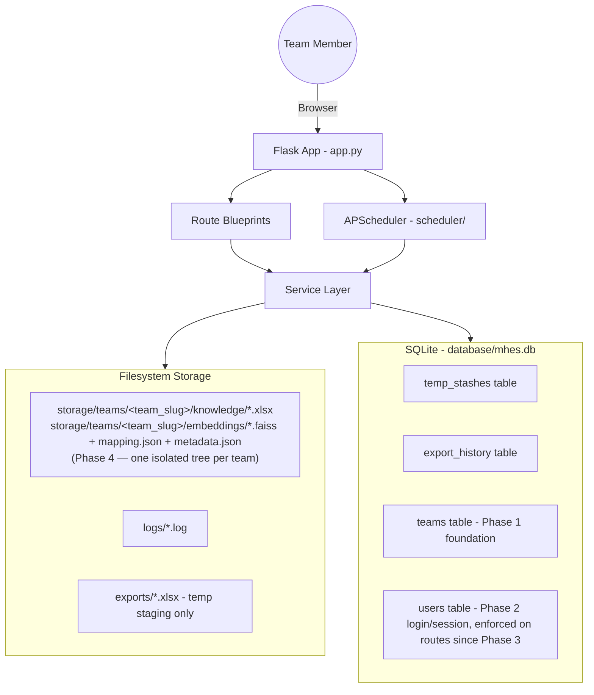
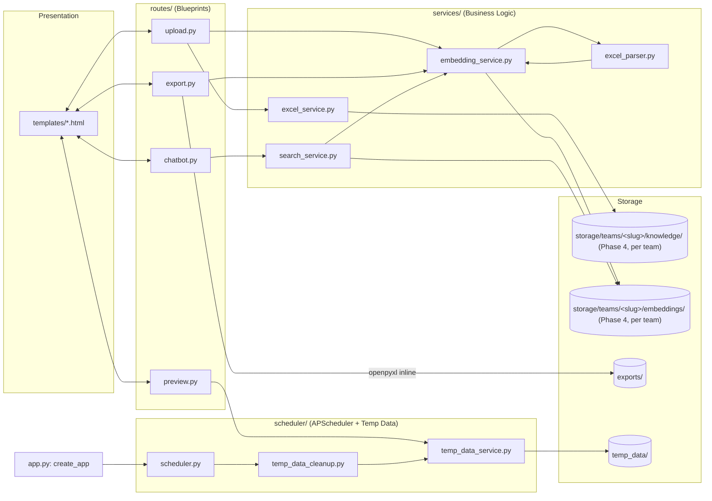
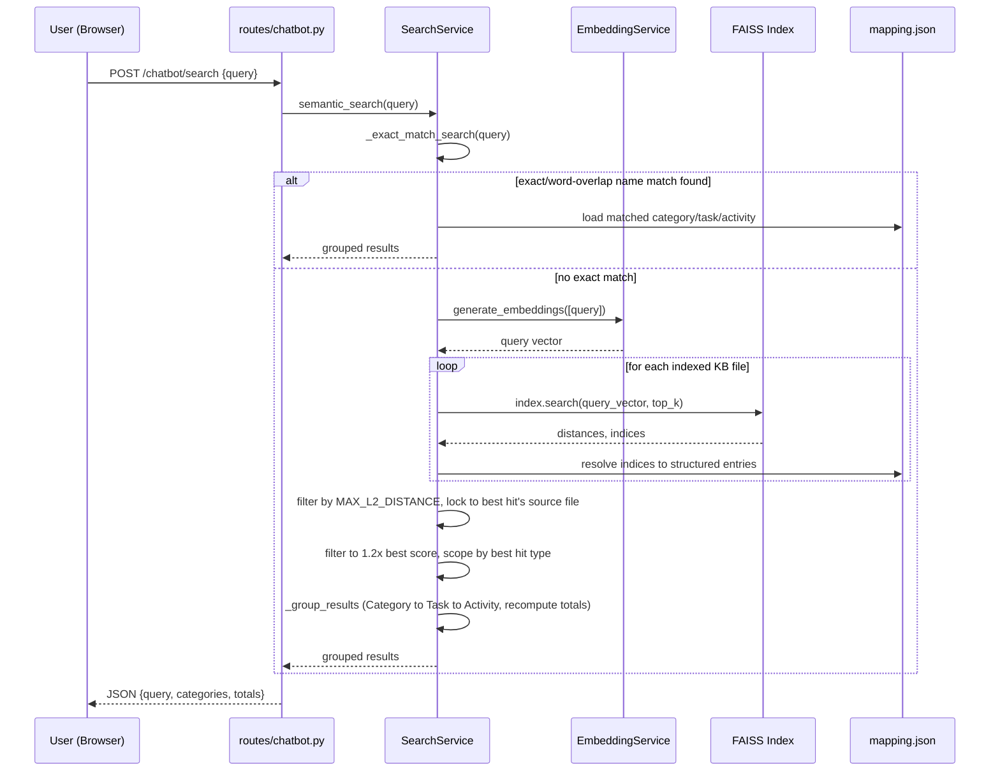
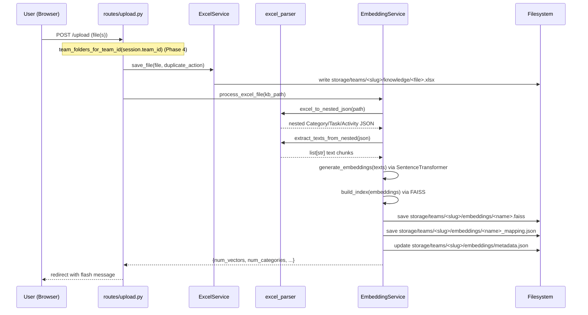
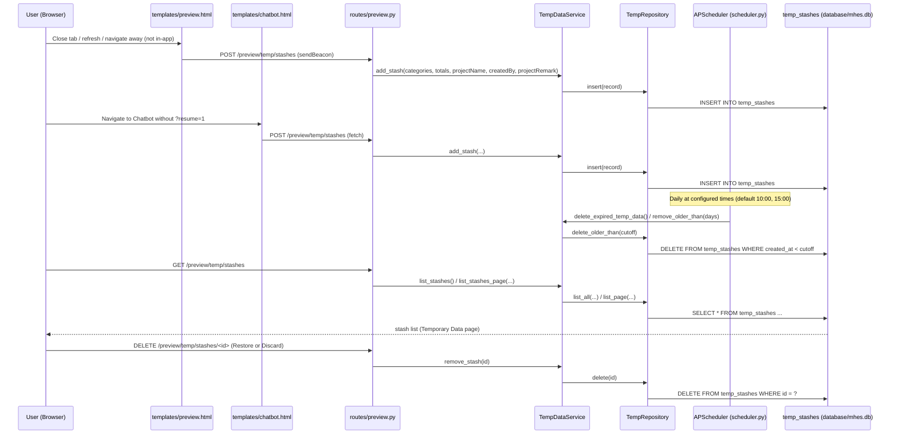

# MHES — Architecture

## 1. System Overview

MHESD (Man Hour Expectation for Development) is a Flask web application that helps
Engineers estimate man-hours by searching a knowledge base of
Excel files using AI semantic search. There is no traditional database —
all state is persisted on the local filesystem (Excel files, FAISS vector
indices, and JSON metadata), including a lightweight in-process scheduler
for maintenance jobs.

Core capabilities:
- Upload `.xlsx` knowledge files (Category → Task → Activity man-hour breakdowns).
- Automatically convert each file into embeddings (Sentence Transformers + FAISS).
- Search the knowledge base via a chatbot-style semantic search interface.
- Assemble and edit estimates on a Preview screen, with results stashable as
  temporary data and restorable later.
- Export selected results to a formatted Excel workbook.
- Automatically purge old temporary data on a daily schedule (APScheduler).
- Multiple teams, each with an isolated Knowledge Base/embeddings tree and
  role-based logins (Admin / Team Manager / Member) — see §5b–§5e.

> **Note:** an earlier draft of this document described export auto-adding
> new Category/Task/Activity data back into the Knowledge Base. That is
> not implemented in `routes/export.py` — export only produces a
> downloadable workbook; it never writes into `kb_knowledge/` (now
> per-team `storage/teams/<slug>/knowledge/`) or triggers embedding.



## 1a. Multi-Team Architecture — Consolidated Overview

MHES was extended from a single-tenant tool into a multi-team system
across eight incremental phases (full list in "Migration History"
below). This section pulls the six load-bearing pieces of that work
into one place; each links to the detailed phase section for the
mechanics.

### Authentication flow

1. `POST /auth/login` (`routes/auth.py`) — `AuthService.authenticate()`
   verifies `username`/`password` against the `users` table
   (`werkzeug.security` password hashing, never plaintext).
2. On success, the Flask session (built-in, `SECRET_KEY`-signed cookie —
   no new session library) is populated with `user_id`, `username`,
   `team_id`, `role`.
3. Every subsequent request re-reads the full user record from `users`
   by `user_id` (`utils/auth.py::get_current_user`) — nothing sensitive
   is cached in the cookie itself beyond those four values.
4. `POST /auth/logout` clears the session outright.
5. A default `admin` account is seeded on first startup, attached to the
   default "Infrastructure Team" (see §5c).

There is no self-service password change or user-registration flow yet —
accounts are created directly via `UserRepository.insert()` (a one-off
script), same as team import/export template configuration.

### Team architecture

- **`teams`** (`id`, `name`, `slug`, `created_at`) is the root entity —
  every other multi-team concept hangs off `team_id` or a team's `slug`.
- Every **user** belongs to exactly one team (`users.team_id`).
- A team's **Knowledge Base and embeddings** live in an isolated
  filesystem tree, `storage/teams/<slug>/{knowledge,embeddings}/`,
  named by `slug` (not the raw `name`, so spaces/punctuation never leak
  into a path) — see §5e.
- A team may have its own **Excel import column mapping** (§5g) and
  **export column template** (§5h) — both optional; a team with neither
  configured behaves exactly as the original single-tenant app did.
- Exactly one team, "Infrastructure Team" (`slug=infrastructure-team`),
  is guaranteed to exist on every install — it's what all pre-multi-team
  data was attributed to. "Development Team" appears in later phases'
  examples but is not a guaranteed default; it only exists in
  environments where it was created for testing/demo purposes.

### Knowledge Base isolation

Before Phase 4, `kb_knowledge/`/`embeddings/` were single shared
folders. Every team now gets its own copy of that same folder pair:

```
storage/
  teams/
    infrastructure-team/
      knowledge/       -- .xlsx files (was the shared kb_knowledge/)
      embeddings/       -- *.faiss + *_mapping.json + metadata.json (was the shared embeddings/)
    development-team/
      knowledge/
      embeddings/
```

Isolation is structural, not access-controlled: `ExcelService` and
`EmbeddingService` are unmodified from the single-tenant version — they
just get constructed with whichever team's folder path the calling
route resolved from `session["team_id"]`
(`utils/team_storage.py::team_folders_for_team_id`). A request literally
cannot reach another team's files because it never holds a reference to
that folder. See §5e for the migration that moved pre-existing data into
Infrastructure Team's folder.

### Embedding structure

Unchanged in file *format* from the single-tenant design — the change is
entirely about *where* these files live and what identifies them:

- One FAISS `IndexFlatL2` index per KB file (`<name>.faiss`).
- One nested Category → Task → Activity JSON per KB file
  (`<name>_mapping.json`).
- One `metadata.json` per team (not per file) — a registry of every
  embedded file *for that team*, including (as of Phase 5) a `"team"`
  field stamped into each record for self-description, and (Phase 5)
  `index_path`/`mapping_path` always recomputed from the current
  `embeddings_folder` rather than trusted from whatever was stored at
  embed time — closing a real path-staleness bug found while migrating.
- `EmbeddingService` now takes a mandatory `team_slug` (Phase 5) purely
  for traceability (log lines, metadata records) — never used to
  compute a path; the path is already team-scoped by the caller.
- `SearchService` inherits `team_slug` from the `EmbeddingService` it
  wraps and only ever loads that team's `metadata.json` — the exact
  same exact-match/FAISS-fallback/grouping algorithm as before, just
  scoped to files a team can actually see. See §5e and §6.

### Permission model

Three roles, stored on `users.role`, checked on every request via
`utils/permissions.py` (decorators for app-level routes,
`before_request` hooks for blueprints):

| Capability | Admin | Team Manager | Member |
|---|---|---|---|
| Chatbot / Preview / Export (own team) | ✅ | ✅ | ✅ |
| Manage Knowledge Base (`/upload/...`) | ✅ | ✅ | ❌ |
| Manage users (`/admin/users`) | ✅ | ❌ | ❌ |
| Manage teams (`/admin/teams`) | ✅ | ❌ | ❌ |
| See other teams' Export History | ✅ | ❌ | ❌ |

An unauthenticated request gets a flash + redirect to `/auth/login` (or
a `401` JSON body for AJAX/fetch calls); a wrong-role request gets a
flash + redirect to `/` (or `403` JSON). See §5d for the enforcement
mechanics and the known "Team Manager manages *all* KB files, not just
their own" gap that existed between Phase 3 and Phase 4.

### Migration history

| Phase | What it added | Key files |
|---|---|---|
| 1 | `teams` table; seeded "Infrastructure Team". No behavior change. | `repositories/team_repository.py`, `utils/migration.py::create_default_team` |
| 2 | `users` table, password hashing, login/logout, session. No route enforced login yet. | `repositories/user_repository.py`, `services/auth_service.py`, `routes/auth.py`, `utils/migration.py::create_default_admin_user` |
| 3 | Role-based enforcement on every route; new Admin-only `admin_bp` (read-only user/team lists). | `utils/permissions.py`, `routes/admin.py` |
| 4 | Knowledge Base/embeddings split into per-team folders; existing data migrated (copied, then legacy folders retired to `.bak`). | `utils/team_storage.py`, `utils/migration.py::migrate_kb_to_team_storage` |
| 5 | Explicit team context in `EmbeddingService`/`SearchService`; fixed a stale-absolute-path bug in `metadata.json`. | `services/embedding_service.py`, `services/search_service.py` |
| 6 | `export_history` gained `team_id`/`created_by_user_id`; Export History list/download/view scoped per team (Admin sees all). | `services/export_history_service.py`, `routes/export.py` |
| 7 | Per-team Excel **import** column mapping — one parser, configurable roles. | `repositories/team_import_config_repository.py`, `services/excel_parser.py` |
| 8 | Per-team Excel **export** column template — one renderer, configurable columns. | `repositories/team_export_template_repository.py`, `routes/export.py::_build_workbook` |
| 9 | Import "phases mode" — configurable `sheet`/`header_row` (fixes real files whose headers aren't on row 1) and per-row phase-column expansion (each phase becomes its own Activity Detail, instead of collapsing a row to one total). | `services/excel_parser.py::_process_phases_sheet` |

Every phase after Phase 1 was designed so that a team with no
configuration for that phase's feature behaves identically to before the
phase existed — verified per phase via the Flask test client, not just
inspection. See `docs/DATABASE.md`'s consolidated schema overview for
the corresponding table-by-table history.

## 2. Application Architecture

The app follows a **Flask application-factory + Blueprint + Service layer**
pattern, plus an in-process background scheduler:

- **`app.py`** — `create_app()` factory. Loads config, ensures required
  folders exist (including `temp_data/`), sets up logging, registers
  blueprints and error handlers, starts the APScheduler background
  scheduler (`scheduler.scheduler.init_scheduler`), and defines the `/`
  (chatbot landing page) route.
- **`config.py`** — `Config` base class with `DevelopmentConfig`,
  `ProductionConfig`, `TestingConfig`. Defines folder paths (including
  `TEMP_DATA_FOLDER`), upload limits (`.xlsx` only, 10 MB max), embedding
  model name (`all-MiniLM-L6-v2`), and temp-data cleanup settings
  (`TEMP_DATA_RETENTION_DAYS`, `TEMP_DATA_CLEANUP_TIMES`,
  `TEMP_DATA_TIMEZONE`).
- **`routes/`** — Thin Flask Blueprints; delegate all logic to `services/`
  (and, for Preview stashes, to `scheduler/`).
- **`services/`** — Business logic: Excel I/O, Excel parsing, embedding
  generation/indexing, semantic search.
- **`scheduler/`** — APScheduler integration and the temporary-data (Preview
  stash) store: scheduling, cleanup logic, and a manual CLI trigger. See
  §4 and §7.
- **`utils/`** — Cross-cutting helpers (logging setup, file utilities).
- **`templates/`** — Jinja2 views rendered server-side (Bootstrap 5 UI).



## 3. Frontend

Server-rendered Jinja2 templates styled with Bootstrap 5 and Bootstrap
Icons (CDN), Inter font (Google Fonts CDN). No JS build step or SPA
framework — interactivity is inline `<script>` blocks per page, using
`sessionStorage`/`localStorage` for client-side state (no cookies/session
framework in use).

- **`templates/base.html`** — Shared shell: collapsible sidebar navigation
  (AI Chatbot, Preview, Temporary Data List — with a live badge showing
  the current stash count, Exported File List, Upload Files — with a
  badge showing the count of files missing embeddings), CSS custom
  properties/theme, and a global click listener that marks in-app link
  navigation (`sessionStorage.mhes_internal_nav`) so pages can distinguish
  "navigated elsewhere in the app" from "closed/left the site" (see §7).
- **`templates/chatbot.html`** — Main semantic-search chat UI; posts
  queries to `/chatbot/search` and renders grouped Category → Task →
  Activity results. The conversation is persisted to `sessionStorage` and
  only resumed when arriving via `?resume=1` (set by Preview's "Add More /
  Back to Chatbot" link); any other entry path starts a fresh conversation
  and stashes pending Preview data server-side first (see §7).
- **`templates/upload.html`** — File upload UI (drag/drop multi-file),
  knowledge base file list with delete/re-embed actions and embedding
  status badges.
- **`templates/preview.html`** — Assembles and edits the Category → Task →
  Activity estimate hierarchy inline (add/delete/edit, live totals),
  exports to Excel, and stashes its data server-side on tab close/refresh
  via `pagehide` + `navigator.sendBeacon` (see §7).
- **`templates/temp_data.html`** — Lists server-side Preview stashes
  (`GET /preview/temp/stashes`), with date-range/project-name filtering and
  pagination, and a **View** action per row.
- **`templates/temp_data_detail.html`** — Read-only breakdown of a single
  stash (`GET /preview/temp/<id>`), with independent **Restore to Preview**
  and **Discard** actions.
- **`templates/exported_files.html`** — Lists export history
  (`GET /export/files`, backed by the `export_history` SQLite table — see
  §5), with date-range/project-name filtering, pagination, and **View**/
  **Download** actions per row.
- **`templates/export_detail.html`** — Read-only, print-optimized view of
  a single exported estimate (`GET /export/files/<filename>/view`), with
  **Download Excel** actions.
- **`static/css`, `static/js`, `static/images`** — Present but currently
  empty placeholders (`.gitkeep` only); all styling/JS lives inline in
  templates today.

## 4. Backend

Flask Blueprints registered in `app.py::_register_blueprints`:

| Blueprint | Prefix | File | Responsibility | Access (Phase 3, see §5d) |
|---|---|---|---|---|
| `upload_bp` | `/upload` | `routes/upload.py` | Upload `.xlsx` files, duplicate detection (rename/overwrite), auto-trigger embedding generation, delete/re-embed KB files | `Admin`, `Team Manager` |
| `chatbot_bp` | `/chatbot` | `routes/chatbot.py` | Render chatbot page; `/chatbot/search` runs semantic search | Any logged-in user |
| `preview_bp` | `/preview` | `routes/preview.py` | Render the Preview page and the Temporary Data page (`/preview/temp`); `GET/POST /preview/temp/stashes` and `DELETE /preview/temp/stashes/<id>` manage server-side Preview stashes via `scheduler.temp_data_service.TempDataService` | Any logged-in user |
| `export_bp` | `/export` | `routes/export.py` | `/export/excel` builds a styled `.xlsx` workbook from submitted category/task JSON via openpyxl, uploads it to Google Cloud Storage (see §5a), and returns it as a download. Output-only — it does not write into the Knowledge Base or trigger embedding | Any logged-in user |
| `auth_bp` | `/auth` | `routes/auth.py` | `GET/POST /auth/login` — render the login page / verify credentials and start a session; `POST /auth/logout` — clear the session. See §5c | Public (must stay reachable while logged out) |
| `admin_bp` | `/admin` | `routes/admin.py` | `GET /admin/users` — list all users (with team name); `GET /admin/teams` — list all teams. Read-only views over data that already existed; see §5d | `Admin` only |

Supporting services:

- **`services/excel_service.py`** (`ExcelService`) — Validates extensions,
  saves uploads into whichever folder it's constructed with (the current
  user's team-scoped `storage/teams/<slug>/knowledge/`, as of Phase 4 —
  see §5e) with duplicate-safe naming, lists and deletes KB files, reads a
  KB file into a DataFrame. The class itself has no notion of teams; it
  only ever operates on the folder path it was given.
- **`services/excel_parser.py`** — `excel_to_nested_json()` parses an Excel
  file (all sheets) with flexible column matching (`Category`, `Task`,
  `Detail`/`Activity`, `Estimate`, `Buffer`) into a nested
  Category → Task → Activity structure, forward-filling merged cells and
  generating rich natural-language `text` fields per level for embedding.
  `extract_texts_from_nested()` flattens all `text` fields for the
  embedding pipeline. Accepts an optional per-team `column_mapping`
  (Phase 7, see §5g) so teams with non-generic headers still resolve to
  the same five roles without a separate parser.
- **`services/search_service.py`** (`SearchService`) — See §6; matches by
  exact/partial name first (now including word-level compound scoping,
  e.g. "wordpress documentation" scopes to the "Wordpress" category from a
  single shared word), falling back to FAISS semantic search scoped to the
  best-matching file's source.
- **`services/export_service.py`** — Stub class (`NotImplementedError`
  methods); the actual export logic used by the app lives inline in
  `routes/export.py` (`_build_workbook`, for the downloadable workbook —
  export never writes into the Knowledge Base).
- **`services/auth_service.py`** (`AuthService`) — Password hashing
  (`werkzeug.security.generate_password_hash`) and credential
  verification (`authenticate(username, password)`) against the `users`
  table, via `repositories/user_repository.py`. See §5c.
- **`utils/logger.py`** — Configures a rotating file handler
  (`logs/mhes.log`, 5 MB × 5 backups) plus console logging.
- **`utils/file_utils.py`** — Small filename/extension/size helpers.
- **`utils/auth.py`** — `get_current_user()`: reads `user_id` from the
  Flask session and re-reads the full user record from `users` on every
  request (same per-request-reconstruction style as the other services).
  Wired into `app.py`'s `inject_current_user` context processor so
  `current_user` is available in every template.
- **`utils/permissions.py`** (Phase 3) — `login_required`/`roles_required(...)`
  decorators and `require_login`/`require_roles(...)` `before_request`
  hooks. See §5d.

Scheduler package (new):

- **`scheduler/scheduler.py`** (`init_scheduler`) — Creates and starts an
  APScheduler `BackgroundScheduler` (timezone-aware, default
  `Asia/Yangon`), registering one cron job per configured time in
  `TEMP_DATA_CLEANUP_TIMES` (default `10:00` and `15:00`) that calls
  `delete_expired_temp_data`. Idempotent (safe against Flask's debug-mode
  reloader and repeated calls) via stable job IDs and a module-level guard.
- **`scheduler/temp_data_cleanup.py`** (`delete_expired_temp_data`) — The
  single reusable cleanup function, used by both the scheduled job and the
  manual CLI script; logs start/finish and every deleted stash.
- **`scheduler/temp_data_service.py`** (`TempDataService`) — Business logic
  for Preview stashes, backed by `repositories/temp_repository.py`
  (`TempRepository`), which reads/writes the `temp_stashes` table in the
  shared SQLite database `database/mhes.db` (see §5 and
  `docs/DATABASE.md` §7): `list_stashes`, `list_stashes_page`, `add_stash`,
  `remove_stash`, `remove_older_than`. Still shared across every logged-in
  user regardless of team — unlike the Knowledge Base (§5e),
  `temp_stashes` has no `team_id`/`user_id` column yet, so Preview
  stashing/restoring is not yet team- or user-scoped.
- **`scheduler/cleanup_temp_data.py`** — Standalone CLI for forcing an
  out-of-band cleanup run outside the schedule (e.g. for verification).

## 5. Database

The Knowledge Base and embeddings are still filesystem-based (no
relational engine), but MHES **does** use a real SQLite database,
`database/mhes.db`, as the backing store for Preview Temporary Data
stashes, Export History, Teams (Phase 1 of multi-team support), and, as
of Phase 2, Users — see §7, §5b, §5c, and `docs/DATABASE.md` §7–§10 for
full schemas. `database/db.py` opens a single shared, thread-local
`sqlite3` connection per database file (WAL mode, 30s busy timeout), used
by `repositories/temp_repository.py`, `services/export_history_service.py`,
`repositories/team_repository.py`, and `repositories/user_repository.py`.
There is no ORM — all four modules execute raw SQL.

Filesystem-based persistence:

- `storage/teams/<team_slug>/knowledge/*.xlsx` — knowledge base source
  files for one team (Phase 4 — see §5e; was the shared `kb_knowledge/`
  before this phase). User-uploaded only; export never writes into this
  folder (see the note in §1).
- `storage/teams/<team_slug>/embeddings/metadata.json` — that team's
  central registry keyed by filename, tracking categories, vector counts,
  embedding dimension, index/mapping paths, and embedded-at timestamp for
  every processed file.
- `storage/teams/<team_slug>/embeddings/<name>.faiss` — one FAISS
  `IndexFlatL2` vector index per knowledge file, scoped to that team.
- `storage/teams/<team_slug>/embeddings/<name>_mapping.json` — the nested
  Category → Task → Activity JSON for that file, used to resolve FAISS
  hit indices back to structured, human-readable data.
- `uploads/`, `logs/` — working folders for temp uploads and rotating log
  files. `exports/` is now only a temporary local staging area — see §5a;
  generated export workbooks no longer persist there.

SQLite-based persistence (`database/mhes.db`):

- `temp_stashes` table — Preview stashes (see §7), managed by
  `repositories/temp_repository.py` via `scheduler/temp_data_service.py`.
  Supersedes the older `temp_data/stashes.json` flat file and an
  even-older `temp_data/temp_storage.db`.
- `export_history` table — export metadata (project name, file location,
  size, task/hour totals), managed by `services/export_history_service.py`.
  Supersedes an older, separate `exports/export_history.db`.
- `teams` table — Phase 1 multi-team foundation (see §5b), managed by
  `repositories/team_repository.py`. Each team's `slug` also names its
  `storage/teams/<slug>/` folder tree as of Phase 4 (§5e) — not yet
  referenced by `temp_stashes` or `export_history`.
- `users` table — Phase 2 authentication (see §5c), managed by
  `repositories/user_repository.py`; role enforced on every route as of
  Phase 3 (see §5d), and `users.team_id` now also determines which
  team's Knowledge Base a user sees (Phase 4, §5e). Not yet referenced by
  `temp_stashes` or `export_history`.
- `db_migrations` table — tracks which one-shot startup migrations
  (`utils/migration.py`) have already run, so importing legacy data (and
  seeding the default team/admin user, and migrating the Knowledge Base
  into team storage) is idempotent across restarts.

`app.py::_ensure_folders` creates the filesystem directories (including
`database/` and `storage/teams/`) on startup if missing; `app.py::create_app`
then runs the one-shot SQLite/filesystem migrations, in order
(`migrate_stashes_json_to_sqlite`, `merge_legacy_databases_into_mhes`,
`create_default_team`, `migrate_kb_to_team_storage`,
`create_default_admin_user` — both `migrate_kb_to_team_storage` and
`create_default_admin_user` depend on the default team already existing,
hence the ordering) before starting the scheduler. The legacy
`temp_data/stashes.json` / `temp_data/temp_storage.db` /
`exports/export_history.db` files, if present, are left on disk untouched
but are no longer read by the running application after their one-time
import; the legacy `kb_knowledge/` / `embeddings/` folders are similarly
retired (renamed to `.bak`) once migrated — see §5e.

## 5b. Multi-Team Support (Phase 1 — foundation only)

MHES is being incrementally extended to support multiple teams (separate
Knowledge Bases, logins, and import/export formats per team, in later
phases). Phase 1 adds only the data foundation, with **no behavior
change**:

- **`repositories/team_repository.py`** (`TeamRepository`) — raw-SQL
  repository for the new `teams` table (`id`, `name`, `slug`,
  `created_at`), following the exact same style as
  `repositories/temp_repository.py` (no ORM, `ensure_schema()` +
  `CREATE TABLE IF NOT EXISTS`).
- **`utils/migration.py::create_default_team`** — a third one-shot,
  idempotent startup migration (alongside the two described above) that
  creates the `teams` table and seeds one row: `name = "Infrastructure
  Team"`, `slug = "infrastructure-team"`. Tracked in `db_migrations` as
  `create_default_team_v1`.
- **Not yet done** (deliberately deferred to later phases): no
  `team_id` column on `temp_stashes` or `export_history`; no login/session
  system; no per-team scoping of `kb_knowledge/`, `embeddings/`, uploads,
  search, or exports; no `users`/`team_members` tables. Every route,
  service, and existing SQLite table continues to behave exactly as
  before — all current data implicitly belongs to the single seeded
  "Infrastructure Team", but nothing enforces or reads that association
  yet.

See `docs/DATABASE.md` §9 for the full `teams` schema.

## 5c. Authentication (Phase 2 — login/session only)

Building on the Phase 1 team foundation, Phase 2 adds real login
credentials and session state, with **no route-level enforcement yet**
and **no changes to Knowledge Base, search, or estimation logic**:

- **`repositories/user_repository.py`** (`UserRepository`) — raw-SQL
  repository for the new `users` table (`id`, `username UNIQUE`,
  `password_hash`, `team_id`, `role`, `created_at`), same style as
  `repositories/team_repository.py`. `role` is constrained at the SQLite
  level (`CHECK(role IN ('Admin', 'Team Manager', 'Member'))`).
- **`services/auth_service.py`** (`AuthService`) — hashes passwords with
  `werkzeug.security.generate_password_hash` and verifies login attempts
  with `check_password_hash`; never stores or compares plaintext.
- **`routes/auth.py`** (`auth_bp`, prefix `/auth`) — `GET /auth/login`
  renders the login page; `POST /auth/login` verifies credentials via
  `AuthService.authenticate` and, on success, stores `user_id`,
  `username`, `team_id`, `role` in Flask's session (`SECRET_KEY`-signed
  cookie — the same session mechanism flash messages already used, no
  new dependency); `POST /auth/logout` clears the session.
- **`utils/auth.py`** (`get_current_user()`) — reads `user_id` from the
  session and re-reads the full record from `users` per request; wired
  into `app.py`'s `inject_current_user` context processor so
  `current_user` (or `None`) is available in every template without each
  route passing it explicitly.
- **`templates/login.html`** — minimal login form; `templates/base.html`
  now shows either "Login" (logged out) or the current username/role plus
  a "Logout" button (logged in) in a new sidebar "Account" section.
- **`utils/migration.py::create_default_admin_user`** — a fourth
  one-shot, idempotent startup migration (tracked as
  `create_default_admin_user_v1`) that creates the `users` table and
  seeds one row: `username="admin"`, `role="Admin"`, `team_id` = the
  default team's id. Password comes from the
  `MHES_DEFAULT_ADMIN_PASSWORD` environment variable if set at first run,
  otherwise a random one is generated and logged once (`WARNING` level)
  so an operator can capture it — it is hashed immediately and cannot be
  recovered from the database afterwards.
- **`config.py`** — added `SESSION_COOKIE_HTTPONLY`/`SESSION_COOKIE_SAMESITE`
  ("Lax") settings for the session cookie now carrying login state.

**Deliberately not done in Phase 2** (left for a later phase): no
`@login_required`/route-gating on any existing blueprint — Upload,
Chatbot, Preview, and Export all continue to work identically with or
without a logged-in session; no `team_id` column added to `temp_stashes`
or `export_history`; no per-team scoping of the Knowledge Base or search;
no user self-service (password change, profile page); no admin UI for
creating/editing/deleting users beyond the single seeded account.

See `docs/DATABASE.md` §10 for the full `users` schema.

## 5d. Role-Based Permissions (Phase 3 — authorization layer only)

Phase 3 enforces the role model already stored on `users.role`
(`Admin` > `Team Manager` > `Member`, in decreasing privilege) against
every existing route. **No business logic changed** — every view
function's body is untouched; only *whether a request is allowed to
reach it* changed.

- **`utils/permissions.py`** — the whole permission layer, in one module:
  - `login_required(view_func)` / `roles_required(*roles)` — decorators
    for routes defined directly on `app` (used on `index`, `dashboard`).
  - `require_login` / `require_roles(*roles)` — `before_request` hooks
    for blueprints, registered once per blueprint file (one line each)
    instead of decorating every view function individually:
    - `upload_bp.before_request(require_roles("Admin", "Team Manager"))`
    - `chatbot_bp.before_request(require_login)`
    - `preview_bp.before_request(require_login)`
    - `export_bp.before_request(require_login)`
    - `admin_bp.before_request(require_roles("Admin"))`
  - Both paths funnel through the same two response builders: an
    unauthenticated request gets a flash + redirect to
    `/auth/login?next=<original path>` for HTML requests, or a `401`
    JSON body for AJAX/JSON requests (detected via `Accept`/content-type,
    so the existing `fetch()`-based pages — Preview's stash badge,
    Chatbot's search — get a JSON error instead of an HTML redirect
    body); a logged-in-but-wrong-role request gets a flash + redirect to
    `/` for HTML, or a `403` JSON body for AJAX/JSON.
- **`routes/admin.py`** (new `admin_bp`, prefix `/admin`) — the concrete
  routes behind "Admin: manage users / manage teams". Scoped
  deliberately narrow for this phase: `GET /admin/users` and
  `GET /admin/teams` are **read-only** list views built directly on the
  repositories that already existed (`UserRepository.list_all()`,
  `TeamRepository.list_all()`) — no new mutation logic was added. Actual
  create/edit/delete/role-reassignment management is left for a later
  phase, since that would be new business logic, not an authorization
  layer.
- **`routes/auth.py`** — added `next`-redirect support
  (`/auth/login?next=/some/path`) so a request that got bounced to login
  returns the user to where they were headed; validated against
  open-redirect (must be a same-site path starting with a single `/`).
- **`templates/base.html`** — added an "Administration" sidebar section
  (links to `/admin/users`/`/admin/teams`), visible only when
  `current_user.role == "Admin"`; guarded the Temporary Data badge's
  `fetch()` call to skip when logged out (that endpoint now requires
  login, so an anonymous fetch would otherwise render a JSON error body
  into the badge).
- **`templates/admin_users.html`**, **`templates/admin_teams.html`** —
  new minimal list-view templates for the two `admin_bp` routes.

**Role → access matrix actually enforced:**

| Capability | Admin | Team Manager | Member |
|---|---|---|---|
| Use chatbot / create estimates (Preview) / export results | ✅ | ✅ | ✅ |
| Manage Knowledge Base files (`/upload/...`) | ✅ | ✅ | ❌ |
| Manage users (`/admin/users`) | ✅ | ❌ | ❌ |
| Manage teams (`/admin/teams`) | ✅ | ❌ | ❌ |

**Gap noted in Phase 3, resolved in Phase 4:** at the time this section
was written, "Team Manager: manage **own team's** knowledge files" was
only partially realized, because the Knowledge Base had no `team_id`
concept yet — every Team Manager could manage *every* team's KB files.
Phase 4 (§5e) closed this gap: `/upload/...` now resolves the current
session's `team_id` to that team's isolated
`storage/teams/<slug>/knowledge/` folder, so a Team Manager (or Member,
via Chatbot search) only ever sees and modifies their own team's data.

## 5e. Team-Based Knowledge Base (Phase 4 — storage isolation)

Phase 4 replaces the single shared `kb_knowledge/`/`embeddings/` folders
with one isolated tree per team, so each team's Knowledge Base and search
results are fully separated. **No parsing, embedding, or search logic
changed** — `services/excel_service.py`, `services/excel_parser.py`,
`services/embedding_service.py`, and `services/search_service.py` are
byte-for-byte unchanged from Phase 3. Every one of those classes already
took its folder path as a constructor argument and never assumed a
specific location — so team isolation is achieved entirely by changing
*which path callers pass in*, not by touching what those classes do with
it.

**New structure:**

```
storage/
  teams/
    <team_slug>/
      knowledge/     -- that team's .xlsx KB files (was the shared kb_knowledge/)
      embeddings/     -- that team's *.faiss + *_mapping.json + metadata.json (was the shared embeddings/)
```

Folder names use each team's `slug` (e.g. `infrastructure-team`,
`development-team`), not its raw `name`, so spaces/punctuation in a
team's display name never leak into a filesystem path.

- **`utils/team_storage.py`** (new) — the entire integration point:
  - `team_kb_folder(teams_folder, slug)` / `team_embeddings_folder(teams_folder, slug)`
    — pure path helpers.
  - `team_folders_for_team_id(teams_folder, mhes_db_path, team_id)` —
    looks up a team by id (via `TeamRepository`) and returns
    `(kb_folder, embeddings_folder)`. This is what every route calls,
    passing `session["team_id"]`.
- **`config.py`** — removed the old global `KB_FOLDER`/`EMBEDDINGS_FOLDER`;
  added `STORAGE_FOLDER` (`storage/`) and `TEAMS_FOLDER` (`storage/teams/`).
- **`routes/upload.py`** — `_excel_service()`/`_embedding_service()` now
  resolve the caller's team folder via `team_folders_for_team_id(...,
  session["team_id"])` before constructing `ExcelService`/`EmbeddingService`.
  Requirement 3 ("upload must save files under current user's team") is
  satisfied here: whichever team the logged-in user belongs to is the
  only team whose folder that request can ever touch.
- **`routes/chatbot.py`** — `/chatbot/search` resolves the same way
  before constructing `EmbeddingService`/`SearchService`. Requirement 4
  ("search must only search current user's team embeddings") falls out
  for free: `SearchService` iterates `emb_svc._load_metadata()`, and that
  metadata file is now the current team's alone — there is no other
  team's data anywhere in the object graph a request can reach.
- **`app.py`** — `inject_missing_embeddings` (sidebar badge) and
  `/dashboard` now resolve the same way from `session["team_id"]`
  (skipping/returning zero when logged out, rather than erroring). The
  dashboard (`app.py::_render_dashboard`) is team-scoped for a Team
  Manager, but **system-wide for an Admin**: it aggregates
  Knowledge/Embedded file counts across *all* teams (knowledge is
  imported under the estimation teams, never the Admin's own, so a
  team-scoped Admin view would read 0), skipping any team whose folders
  can't be resolved. Admin lands on this dashboard at `/`; a Team
  Manager lands on the AI Chatbot.
- **`utils/migration.py::migrate_kb_to_team_storage`** — the one-shot
  migration that moves existing data (§ Migration process, below).

**Explicitly not changed:** `services/excel_parser.py` (per the task
constraint), the FAISS index format, the mapping JSON shape, or the
`metadata.json` schema — a team's embeddings after migration are
byte-identical to what they were before, just relocated.

## 5a. Export File Storage (Google Cloud Storage)

Generated export workbooks are stored in a private GCS bucket instead of
the local filesystem — implemented in `services/gcs_service.py`, wired
into `routes/export.py`. The `export_history` SQLite table (see §5 above
and `docs/DATABASE.md` §8) is unchanged by this; its `file_path` column
now stores a GCS object path for new exports instead of a local
filesystem path.

**Configuration** (`config.py`, loaded from `.env` via `python-dotenv` —
see `.env.example`):

| Variable | Purpose |
|---|---|
| `GCP_PROJECT_ID` | GCP project id (optional — inferred from credentials if omitted) |
| `GCP_BUCKET_NAME` | Target bucket name, e.g. `ai-team-001` |
| `GOOGLE_APPLICATION_CREDENTIALS` | Path to a service account JSON key; read directly by the `google-cloud-storage`/`google-auth` client libraries from the process environment — not threaded through `config.py` |

**Bucket setup** (see README.md "Google Cloud Storage Setup" for exact
commands): create a private bucket (uniform bucket-level access, no
public access), create a dedicated service account, grant it
`roles/storage.objectAdmin` scoped to that one bucket only, and download
its JSON key.

**Folder structure inside the bucket** — a fixed prefix, not the bucket
root:

```
ai-team-001/
└── mhes/
     └── bcmm/
          └── 1002/
               ├── estimate_001.xlsx
               ├── estimate_002.xlsx
```

The object path convention is always `mhes/bcmm/1002/{file_name}` (see
`GCS_EXPORT_PREFIX` / `object_path_for()` in `services/gcs_service.py`).

**Upload flow** (`POST /export/excel`):
1. `_build_workbook()` writes the workbook to a temporary local file in
   `exports/` (a scratch directory now, not persistent storage).
2. `upload_excel_to_gcs(local_path, file_name)` uploads it to
   `mhes/bcmm/1002/{file_name}` and returns that object path.
3. The local temp file is deleted (in a `finally` block, so it's cleaned
   up whether the upload succeeds or fails).
4. `export_history.file_path` is set to the returned GCS object path;
   `file_size` is the workbook's size in bytes (captured before the temp
   file was deleted).
5. The already-generated bytes are streamed back to the browser as the
   download response — no second read from disk or GCS is needed for the
   request that just created the file.

**Download flow** (`GET /export/files/<filename>`):
1. The route looks up the `export_history` row for `<filename>` to get
   its `file_path`.
2. `generate_signed_download_url(file_path, download_name=filename)`
   creates a v4 signed URL (15-minute expiry) with a
   `response-content-disposition` header forcing the correct download
   filename.
3. The Flask route responds with an HTTP redirect to that signed URL —
   the browser downloads the file directly from GCS; it never passes
   through the Flask server's bandwidth.

**View flow** (`GET /export/files/<filename>/view`) works the same way,
except it calls `download_excel_bytes(file_path)` to pull the object's
bytes into memory and opens them with `openpyxl.load_workbook()` via an
`io.BytesIO` wrapper (which accepts a file-like object exactly like a
path string), so the read-only in-browser detail view still works without
writing anything to local disk.

**Backward compatibility with pre-migration exports:** rows created
before this migration have a local absolute path (or `NULL`, for the very
oldest rows, predating the `file_path` column) in `file_path` instead of
a GCS object path. `_is_local_path()` in `routes/export.py` distinguishes
the two by shape (`D:\...` / `/...` vs. `mhes/bcmm/1002/...`), so those
older records keep being served straight from local disk, unchanged,
while every export from now on goes through GCS.

**Security:** the bucket is never made public; all reads/writes go
through the service account's credentials, and end users only ever see
short-lived signed URLs, never bucket credentials or a public bucket URL.

## 5f. Team-Aware Export History (Phase 6)

Phase 6 extends multi-team isolation to Export History: every export
record now belongs to exactly one team, and non-Admin users only ever
see and can only download/view their own team's exports. **No Excel
generation logic changed** — `routes/export.py::_build_workbook` (the
actual workbook builder) is untouched; this phase only touches how
export *metadata* is stored and filtered.

- **`services/export_history_service.py`** — schema gains two columns:
  - `team_id INTEGER` — the team this export belongs to.
  - `created_by_user_id INTEGER` — the actual authenticated user who
    triggered the export (`session["user_id"]`), distinct from the
    pre-existing free-text `created_by` (a name typed into the Preview
    form, which may not match any real account).

  `insert_history()` now requires `team_id`; every read method
  (`get_history`, `get_history_page`, `get_history_by_file_name`) takes
  an optional `team_id` filter — `None` means "every team" (Admin-only in
  practice; enforced by the route, not the service).

- **`routes/export.py`** — a new `_team_id_filter()` helper: returns
  `None` for `session["role"] == "Admin"`, otherwise
  `session["team_id"]`. Wired into:
  - `list_exports` — passes the filter into `get_history_page`, so the
    Exported Files list only shows the caller's team unless Admin.
  - `download_export` / `view_export` — passes the filter into
    `get_history_by_file_name`. **This is the real authorization
    boundary**: a non-Admin request for another team's file simply gets
    no matching record and is treated identically to "file not found" —
    there is deliberately no fallback to a locally-reconstructed path
    for an unscoped/missing record (removed from both routes in this
    phase), since that fallback could otherwise leak a legacy local
    export across teams.
  - `export_excel` — passes `session["team_id"]`/`session.get("user_id")`
    into `insert_history` when recording a new export.
- **`templates/exported_files.html`** — shows an extra "Team" column,
  visible only when `current_user.role == "Admin"` (populated by looking
  up each row's `team_id` via `TeamRepository` in `list_exports`).

**Database migration:** follows the same ALTER-if-missing pattern
already used for this exact table's `file_path` column
(`ExportHistoryService._ensure_file_path_column`) rather than the
`db_migrations`-tracked startup migrations used elsewhere —
`_ensure_team_columns` runs from `ExportHistoryService.__init__` itself,
ALTERs in `team_id`/`created_by_user_id` if missing, then backfills every
row still missing a `team_id` onto the default team. Idempotent: the
ALTERs no-op once applied, and the backfill only ever touches
still-unassigned rows.

One related fix required to keep this working: `utils/migration.py`'s
legacy-database merge (`_merge_export_history`, for pre-Phase-2
`exports/export_history.db` files) now also needs the default team to
exist before it runs, since every inserted row needs a `team_id` — so
`app.py` was reordered to call `create_default_team` *before*
`merge_legacy_databases_into_mhes` (previously the reverse).

**Deliberately not done:** `temp_stashes` (Preview stashes) still has no
`team_id`/`user_id` column — Phase 6 was scoped to Export History only,
per its own requirements. Team-scoping Preview stashes is a gap left for
a future phase.

## 5g. Team-Specific Excel Import Configuration (Phase 7)

Different teams may label the same underlying data with completely
different Excel headers — e.g. Development Team's `Feature`/
`Technology`/`Hours` versus Infrastructure Team's `Task List`/
`Category`/`Estimate (Hours)`. Before Phase 7, `excel_parser._map_columns`
only recognized one fixed keyword vocabulary
(`category`/`project`, `task`, `detail`/`activity`, `estimate`/`hour`,
`buffer`), so a sheet using different words for these roles would be
silently skipped entirely (`"could not map columns [...], skipping"`).

Design: **one parser, a per-team column-role mapping, no per-team parser
code.**

```
Excel columns  ->  Mapping configuration (per team)  ->  MHES roles (category/task/detail/estimate/buffer)  ->  existing excel_to_nested_json logic (unchanged)
```

- **`repositories/team_import_config_repository.py`** (new) —
  `TeamImportConfigRepository`, raw-SQL, mirroring `TeamRepository`. One
  row per team in `team_import_configs`
  (`team_id UNIQUE`, `column_mapping` — a JSON dict of role -> that
  team's actual header name, `created_at`). A team with no row is
  completely unaffected (see below).
- **`services/excel_parser.py`** — `_map_columns` and
  `excel_to_nested_json` both gained an optional `column_mapping`
  parameter. The original keyword-matching loop was extracted, unchanged,
  into `_generic_role_matches()`. Resolution order per role:
  1. If `column_mapping` names a header for this role, and that header
     exists (case-insensitively) in the sheet: use it.
  2. Otherwise, fall back to `_generic_role_matches()` for that role —
     the exact pre-Phase-7 heuristic.

  So `column_mapping=None` (no configuration for that team) reproduces
  byte-identical behavior to before Phase 7, and a team only needs to
  configure the roles that actually differ from the generic vocabulary —
  verified: Infrastructure-style headers parse identically with or
  without this change; a `Technology`/`Feature`/`Hours` sheet, previously
  skipped entirely, now parses correctly once mapped.
- **`services/embedding_service.py`** — `process_excel_file` gained the
  same optional `column_mapping` parameter, passed straight through to
  `excel_to_nested_json`. No other embedding/FAISS logic touched.
- **`routes/upload.py`** — new `_team_column_mapping()` helper: looks up
  the current session's team's config via
  `TeamImportConfigRepository.get_by_team_id`, returns `None` if
  unconfigured. Passed into both `process_excel_file` call sites (initial
  upload's auto-embed, and the "Re-embed" action).
- **`utils/migration.py::seed_development_team_import_config`** — a
  best-effort demo seed (not a guaranteed product migration, since
  "Development Team" isn't one of the teams every install has): if a
  team with slug `development-team` exists, seeds
  `{"category": "Technology", "task": "Feature", "detail": "Feature",
  "estimate": "Hours"}`. `task` and `detail` both point at the same
  column deliberately — this illustrative format has no separate
  per-activity breakdown, so each row becomes one Task with exactly one
  Activity of the same name, which the existing 3-level structure already
  supports without any further change. On an install without that team,
  this no-ops and is not marked applied, so it keeps checking on future
  startups.

**Deliberately not done (per explicit scope agreement before
implementation):** no UI to view/edit a team's column mapping — it's
configured directly via `TeamImportConfigRepository.upsert()` (e.g. a
one-off script) for now. Adding an admin/Team-Manager page for this is a
natural next increment, the same way Phase 3's `admin_bp` started
read-only before any edit capability existed.

See `docs/DATABASE.md` §12 for the full `team_import_configs` schema.

> **Naming note:** the seed migration referenced above
> (`seed_development_team_import_config`) still looks for a team with
> slug `development-team`. "Development Team" was later renamed in place
> to "Bamawl Team" (slug `bamawl-team`) via a direct
> `TeamRepository`/`UserRepository` update — a manual admin action, not
> itself a tracked migration. The already-applied seed is unaffected
> (it's tracked in `db_migrations` and never re-runs), but the
> migration's own function name/slug reference is now historical rather
> than descriptive of the team it originally seeded, and would no longer
> find a matching team on a fresh install run today.

## 5h. Team-Specific Excel Export Templates (Phase 8)

`routes/export.py::_build_workbook` mixes two kinds of logic: **shared
structure** (title/Created-By/Date metadata rows, per-category merged
cells, the totals row, and the rich-text Remark section) and **the data
table itself** (which columns appear, their order, label, and width —
previously hardcoded to `Category | Task List | Estimate (Hours) |
Working Day | Remarks` across fixed columns A–E). Phase 8 makes only the
second part configurable per team, applying the same philosophy as
Phase 7: one renderer, a config, no per-team copy of `_build_workbook`.

```
Team's configured column spec  ->  _build_workbook (shared: merges, totals, remark section)  ->  Excel workbook
```

- **`repositories/team_export_template_repository.py`** (new) —
  `TeamExportTemplateRepository`, raw-SQL, mirroring
  `TeamImportConfigRepository`. One row per team in
  `team_export_templates` (`team_id UNIQUE`, `template_config` JSON,
  `created_at`).
- **`routes/export.py::DEFAULT_EXPORT_TEMPLATE`** — a module-level
  constant reproducing the exact pre-Phase-8 column layout
  (`{"sheet_title": "Manhour", "columns": [{"key": "category", "label":
  "Category", "width": 25}, ...]}`). `_build_workbook` now takes an
  optional `template_config` parameter and always falls back to this
  constant — so "no configuration" is byte-for-byte identical to before
  Phase 8, verified directly (same title, headers, merged category
  cells, formulas, and totals row as the original hardcoded version).
- **`_build_workbook`**, generalized (not rewritten) to be config-driven:
  - Column widths, header labels, and header order all come from
    `template_config["columns"]`.
  - The title row, "Created By"/"Date" row placement, the totals row,
    and the Remark section all merge across `len(columns)` (computed
    dynamically) instead of hardcoded to column E.
  - Each column's cell content is chosen by its `key` — a small fixed
    vocabulary handled once: `category` (merged per-category, handled
    after the per-task-row loop, exactly as before), `task` (numbered
    task name), `estimate_hours` (the task's total hours),
    `working_day` (a `/8` formula computed against wherever
    `estimate_hours` actually landed — blank if a template omits that
    column), `remarks`. An unrecognized key renders blank and logs a
    warning rather than failing the whole export.
  - A team can reorder, relabel, resize, or **drop** columns (e.g. no
    `working_day`) purely through configuration — no new Python per
    team. Genuinely new *behaviors* (not representable by this
    vocabulary) would still need a new column key added once, shared by
    every team, same as Phase 7's roles.
- **`routes/export.py::export_excel`** — new `_team_export_template()`
  helper (mirrors Phase 7's `_team_column_mapping()`): resolves
  `session["team_id"]` via the repository, falls back to
  `DEFAULT_EXPORT_TEMPLATE`. Passed into `_build_workbook` as
  `template_config`.
- **`utils/migration.py::seed_development_team_export_template`** — same
  best-effort, environment-specific pattern as Phase 7's import-config
  seed (not a guaranteed migration, since only Infrastructure Team is a
  default team): seeds a compact 4-column template for Development Team
  — `Technology` (category) / `Task` / `Hours` (estimate) / `Notes`
  (remarks) — with no `working_day` column, demonstrating both
  relabeling and dropping a column.

**Explicitly unchanged:** all styling primitives (fonts/fills/borders)
and the per-category merge mechanics — these are shared, structural
concerns, identical for every team's export regardless of template.

> **Note:** `_build_workbook` (with its Remark rendering) has since moved
> out of `routes/export.py` into
> `services/export_workbook_service.py::build_workbook`, dispatched via
> the `DefaultExportStrategy` (see §5j). Its **Remark** section — the
> Infrastructure-Team-only project remark — is converted from Preview's
> sanitized HTML to an openpyxl `CellRichText` (bold/italic/color and
> bullet/numbered list structure preserved; underline is intentionally
> dropped, since the Preview's Quill toolbar offers no underline), and
> per-task remarks go to the `remarks` column. The renderer is in
> `export_workbook_service.py` itself; the older `services/remark_html.py`
> is no longer imported by any route/service.

**Deliberately not done (per explicit scope agreement before
implementation):** no UI to view/edit a team's export template — same
precedent as Phase 7's import mapping; configured directly via
`TeamExportTemplateRepository.upsert()` for now.

See `docs/DATABASE.md` §13 for the full `team_export_templates` schema.

## 5i. Phase-Breakdown Excel Import ("Phases Mode")

Real-world team Excel files onboarded after Phase 7 (`bamawl_import_export_format.xlsx`,
`kikan_import_export_format.xlsx`, `sgl_import_export_format.xlsx` in
`simple_resource/`) exposed two problems the flat `column_mapping` from
Phase 7 didn't solve:

1. **The real header row often isn't row 1.** These workbooks have a
   percentage/phase-group block sitting *above* the real header row
   (e.g. Bamawl's `ALL_Detail` and KiKan's `工数詳細` both have their
   real headers on row 4; SGL's detail sheet has them on row 2).
   `pd.read_excel` always defaulted to reading row 1 as the header, so
   every column came back as `Unnamed: 0`, `Unnamed: 1`... and the
   sheet was skipped regardless of how `column_mapping` was configured.
2. **Collapsing a row to one `estimate` value throws away exactly the
   detail a future estimate needs.** Each row in these files already
   breaks its total down across many phase columns (Development, Code
   Review, Prototype, Business Flow, ERD, DFD, DB Design, Test
   Specification, Implementation, Risk, Management, ...). Mapping
   `estimate` to only the `Total(h)` column — the Phase 7 approach —
   would discard every one of those phases permanently; there is no
   field anywhere in MHES's data model to hold them once collapsed, so
   they could never be recovered or reused for a future estimate.

**Fix for #1 — `sheet`/`header_row` in `column_mapping`:**
`excel_to_nested_json` now reads `column_mapping.get("sheet")` (if
given, only that one sheet is read at all — the workbook's other tabs,
e.g. cost-summary sheets like `見積・金額サマリ`/`工数・費用`, are
never even attempted) and `column_mapping.get("header_row")`
(1-indexed spreadsheet row, converted to pandas' 0-indexed `header=`
argument). Omitting both reproduces the exact pre-existing behavior
(read every sheet, header row 1).

**Fix for #2 — "phases mode":** when `column_mapping` contains a
`phase_columns` list, `excel_to_nested_json` routes the sheet through
`_process_phases_sheet` instead of the flat category/task/detail/estimate
logic. Each row still becomes one Task, but **every configured phase
column that has a value becomes its own Activity Detail** under that
task — nothing is collapsed into a single number:

```
Task: Login/Logout
  ├─ Activity: Development        — 24h
  ├─ Activity: Code Review        — 1.68h
  ├─ Activity: Prototype          — 3.6h
  ├─ Activity: Business Flow      — 0.96h
  ├─ Activity: Screen/Form/Function — 9.6h
  ├─ Activity: Risk               — 3.36h
  ├─ Activity: Management Manhours — 12.13h
  └─ ... (every phase column present with a nonzero value)
```

The Task's total (`estimate_hours`) is still computed exactly as
before — `_build_nested_output` already sums whatever activities a task
has, unchanged — so no other code (embedding, search, export) needed to
change at all; only how `excel_to_nested_json` populates its
intermediate `all_categories` structure changed.

**Config shape (phases mode):**
```json
{
  "sheet": "ALL_Detail",
  "header_row": 4,
  "task_column": "Function",
  "id_column": "ID",
  "category_column": "Requirements",
  "phase_columns": [
    {"label": "Development", "column": "Development man-hours (h)"},
    {"label": "Code Review", "column": "Code review (h)"},
    {"label": "Prototype", "column": "Prototype(h)"}
  ],
  "total_column": "Total(h)"
}
```
- `task_column` (required) — the column holding each row's task/function name.
- `category_column` *or* `category` (one required) — either read a real
  grouping column per row (forward-filled, like the flat mode's category
  handling), or apply one fixed literal category name to every row (for
  files with no grouping column at all). Bamawl's `ALL_Detail` uses
  `category_column: "Requirements"` — each Requirement value becomes a
  Category above its tasks (blank cells forward-fill from the Requirement
  above). Its export writes each task's category back into that same
  Requirements column, so the grouping round-trips.
- `phase_columns` (required, ≥1) — each becomes one Activity Detail.
  Column names are matched whitespace/newline-tolerant and
  case-insensitively (`_find_column`/`_normalize_header`), since these
  headers are frequently wrapped across lines purely for column width
  (e.g. `"\nDevelopment man-hours (h)\n"`).
- `total_column` (optional) — never stored; used only as a sanity
  cross-check, logging a warning if the sum of matched phase columns
  disagrees with this column's value by more than 0.5h for a row (a
  signal that a phase column was missed or mismatched, not a hard
  failure).
- `id_column` (optional) — a column that must hold a real number for a
  row to count as a task row (checked *before* `task_column`'s
  forward-fill), so a trailing per-role subtotal/rollup block (blank or
  label-text id, but numeric phase values) isn't folded into the last
  real task above it.
- `extra_columns` (optional) — a list of `{"field": ..., "column": ...}`
  entries; each resolved column's value is set verbatim on the task's
  `field` key and passed through generically all the way to
  Preview/export (e.g. Bamawl's and KiKan's own `Status` column). Not
  for cross-row accumulation or a second worksheet — those still need a
  dedicated parser.

A row with no task name (typically a group-rollup/summary row in these
workbooks) or with every phase at zero/blank is skipped, same spirit as
the flat mode's "no detail = skip this row" rule.

**Explicitly unchanged:** `_build_nested_output`, `extract_texts_from_nested`,
`services/embedding_service.py`, `services/search_service.py`, and every
export code path — none of them needed to change, since a task with 10
activities is structurally identical (as far as they're concerned) to a
task with 1.

**Known limitation:** a handful of Bamawl's `ALL_Detail` phase columns
are ambiguous/duplicated in the source workbook itself (e.g. `Review(h)`
appears twice — once after `Screen/Form/Function`, once after
`Test Specification` — and pandas disambiguates re-occurring headers by
appending `.1`, which `phase_columns` must reference explicitly to pick
the intended one). Seeding a fully complete, unambiguous phase list for
that file needs a human who understands the workbook's intended
structure to confirm which column is which, rather than being safely
inferable from the header text alone.

See `docs/DATABASE.md` §11 (updated) for how a `team_import_configs` row
now supports either mapping shape.

## 5j. Per-Team Excel Export, Phase Formulas & Template Validation

The import side (§5g/§5i) has a mirror on the export side, plus two
teams whose Preview/export is driven by per-phase auto-calculation and a
strict-vs-lenient template validator. Everything here dispatches by team
**name** — no route holds team-specific logic of its own.

### Export Strategy Pattern

`routes/export.py::export_excel` no longer branches through an
if/elif chain of free functions; it delegates to a Strategy Pattern:

- **`services/base_export_service.py`** — `BaseExportService` (one
  `build(context)` method) and `ExportContext`, the dataclass carrying
  everything a strategy might need: `filepath`, `categories`,
  `project_name`, `created_by`, and the optional
  `column_mapping`/`template_path`/`template_config`/`project_remark`/
  `phase_coefficients` (each strategy uses only the fields it needs).
- **`services/export_strategies.py`** — `EXPORT_STRATEGY_REGISTRY` maps
  a team name to its `BaseExportService` subclass: `Bamawl Team →
  BamawlExportBuilder`, `KiKan Team → KikanExportBuilder`, `SGL Team →
  SglExportBuilder`, `SSD Team → SsdExportBuilder`; every other team
  gets `DefaultExportStrategy` (which delegates to
  `services/export_workbook_service.py::build_workbook`, the
  column-layout renderer of §5h).
- **`routes/export.py::_select_export_strategy`** builds the right
  `ExportContext` per team. Bamawl/KiKan are still config-gated (their
  own `resolve_column_mapping` must return a seeded mapping, else they
  fall back to `DefaultExportStrategy`); SGL/SSD dispatch
  unconditionally (they derive structure from the template itself, with
  no DB `column_mapping`). Each builder lives in its own module and owns
  its own `*ExportError`, caught individually in `export_excel` and
  surfaced to the client as a 400.

### Per-phase auto-calculation (Bamawl & KiKan)

Both teams' Excel templates derive every phase from a single
**Development** man-hours input via fixed ratio coefficients. That
formula is encoded once, on the backend:

- **`routes/preview.py`** holds `_BAMAWL_PHASE_FORMULA` and
  `_KIKAN_PHASE_FORMULA` — each a `{"base": "Development", "derived":
  [{"label", "of": [...], "coef"}]}` spec whose `derived` list is
  dependency-ordered (each phase's inputs precede it) and mirrors the
  template's own row-2 coefficients / row-5 formulas.
  `_phase_formula_for_team(team_name)` returns the right one (or `None`),
  injected into the Preview as `PHASE_FORMULA`.
- **`templates/preview.html`** makes only the base phase editable;
  derived phases are read-only and recomputed live (`applyPhaseFormula`
  → `recalcAllTasks`). On load, `computeCoefsFromFirstTask` adopts the
  **first task's** implied ratios as the default percentages, then
  **every task is recomputed uniformly** so a project assembled from
  several source workbooks uses one consistent set.
- A collapsible **Percentage (%)** panel (`renderCoefPanel`) lets the
  user edit each derived phase's coefficient as a percent; a change
  recomputes every task (`recalcAllTasks`), re-renders, and persists.
  New tasks use the current percentages. Phases whose coefficient is 0
  are hidden in the UI (kept in the data as 0).

### `phaseCoefficients` flow (Preview ↔ backend ↔ export)

The edited percentages travel to the export so the workbook computes
with the user's adjusted ratios:

```
preview.html  →  POST /export/excel {phaseCoefficients: [{label, coef}]}
              →  routes/export.py::export_excel
              →  ExportContext.phase_coefficients
              →  services/bamawl_export_builder.py (written into the
                 template's coefficient row, row 2, matched by label)
```

### Live-formula preservation on export

Bamawl's and KiKan's builders keep the exported workbook's formulas
live (change Development in Excel → everything recomputes):

- Only **Development** is written as a literal; every derived phase and
  the row total keep the template's own formula, captured from a
  representative data row and re-injected per row via
  `openpyxl.formula.translate.Translator` (relative refs like `D5`
  shift with the row; absolute coefficient refs like `E$2` stay put).
  Bamawl deliberately captures from the *second* data row, whose
  coefficient refs are already absolute.
- Edited `phase_coefficients` are written into the template's
  **coefficient row (row 2)**, so the live formulas compute with the
  user's percentages.
- Bamawl **hides** (never deletes) any phase column whose effective
  percentage is 0, and explicitly forces non-zero columns visible, so
  every `Total(h)=SUM(...)` and `TotalManhour` formula keeps
  referencing an intact range.
- SGL and SSD deliberately stay **literal** — SSD because its template
  has `標準作業工数` VLOOKUP-driven special rows whose values must be
  fixed at export time rather than left to recalculate.

The Preview's **Buffer** field is shown only for teams in
`BUFFER_EXPORT_TEAMS` (Infrastructure Team — the only export that uses
`total_hours = estimate + buffer`); Bamawl/KiKan/SGL/SSD Totals are just
the sum of phase columns. The project-level **Remark** editor and
per-task Remarks are gated on `REMARKS_TEAMS` (Infrastructure Team only).

### Template validation & resolution

- **`services/team_template_validator.py`** — `TeamTemplateSpec`
  (per-team: required sheet names, header sheet/row, expected headers,
  `column_mapping`, optional `sample_template_path`, optional
  `template_version`) and `validate_team_template()`. By default the
  header check is strict (exact, position-by-position). A spec that sets
  **`required_columns`** switches to a lenient check: only those columns
  must be present in the header sheet (whitespace/case-tolerant, any
  order, extra columns allowed) and only the header sheet is required.
  **Bamawl** sets `required_columns=[ID, Requirements, Function,
  Development man-hours (h)]` in
  `utils/migrations/bamawl_import_export_config.py`; every other
  registered team keeps the strict check.
- **`services/team_template_registry.py`** — `get_team_template_spec`
  returns a team's registered spec (Bamawl/KiKan/SGL/SSD) or `None`
  (generic lenient parser, no structural validation).
- **Template resolution / `simple_resource/` fallback** —
  `simple_resource/` holds the real customer workbooks, is **git-ignored**,
  and is absent on a clean deploy; the app no longer reads it at
  runtime. Each specially-supported team's `template_path()` and
  `fixed_phase_labels()` now use the git-tracked
  `import/<team>/<team>_import_template.xlsx` (Bamawl's export
  `template_path` points there too; SGL/SSD read their fixed phase
  labels from that same sample). The sample files share the real
  workbooks' column structure, so validation, fixed-phase resolution,
  and export all work without `simple_resource/`.

## 6. AI Chatbot Flow

The chatbot performs retrieval-based semantic search (no generative LLM
call is currently wired in).

**Indexing (on upload/re-embed), via `EmbeddingService.process_excel_file`:**
1. `excel_parser.excel_to_nested_json()` converts the Excel file into a
   Category → Task → Activity JSON with generated `text` descriptions.
2. `excel_parser.extract_texts_from_nested()` collects every `text` field
   as an embedding chunk.
3. `EmbeddingService.generate_embeddings()` encodes the texts with
   `SentenceTransformer("all-MiniLM-L6-v2")`.
4. `EmbeddingService.build_index()` builds a FAISS `IndexFlatL2` and
   `save_index()` writes it to `<team_embeddings_folder>/<name>.faiss`
   (Phase 4 — see §5e; the class itself doesn't know it's team-scoped, it
   just writes to whatever folder it was constructed with).
5. The nested JSON is saved as `<team_embeddings_folder>/<name>_mapping.json`.
6. `<team_embeddings_folder>/metadata.json` is updated with per-file stats.

**Query (on `/chatbot/search`), via `SearchService.semantic_search`:**
1. **Exact match phase** (`_exact_match_search`) — checks (case-insensitively,
   tiered exact / contains / contained-by) whether the query names a known
   Category, Task, or Activity. Compound scoping now matches on any
   meaningful **shared word** with a category name (not just the full name
   as a contiguous substring), so a partial query like "wordpress
   documentation" scopes to the "Wordpress" category before matching
   "Documentation" as a task within it. Detail-level matches win over
   task-level when strictly more specific.
2. **Fallback semantic phase** — if no exact match, the query is embedded
   and searched against every file's FAISS index *within the current
   user's team* (Phase 4 — `routes/chatbot.py` constructs `EmbeddingService`
   with that team's `embeddings_folder`, so `SearchService` never even
   sees another team's `metadata.json`); hits beyond
   `MAX_L2_DISTANCE = 1.4` are discarded, then results are restricted to
   the same `source` file as the best-scoring hit (preventing results from
   mixing unrelated KB files within the team), then further filtered to
   within `1.2×` the best score, and scoped to the best hit's level
   (activity/task).
3. **Grouping** (`_group_results`) — matched hits are grouped back into
   Category → Task → Activity, with task-level totals (estimate, buffer,
   final) recomputed to reflect only the displayed activities.
4. The route returns JSON (`{query, categories, totals}`) which the
   `chatbot.html` template renders as a structured result table.





## 7. Scheduler & Temporary Data (Preview Stashing)

Preview data (the in-progress Category → Task → Activity estimate a user
is assembling) normally lives only in the browser's `sessionStorage`. To
avoid losing it, the app can **stash** a snapshot to the server — the
`temp_stashes` table in the shared SQLite database, `database/mhes.db`
(see §5 and `docs/DATABASE.md` §7) — at several points, and **restore**
it later from the Temporary Data page, with old stashes automatically
purged on a schedule.

**Stash triggers:**
- Navigating to the Chatbot in any way other than "Add More / Back to
  Chatbot" (i.e. without `?resume=1`) — handled in `templates/chatbot.html`.
- Closing the tab/browser, refreshing, or navigating to a URL outside the
  app while Preview has data — handled in `templates/preview.html` via the
  `pagehide` event and `navigator.sendBeacon` (chosen because it reliably
  fires mid-unload, unlike a normal `fetch`). Normal in-app link clicks are
  excluded via the `mhes_internal_nav` flag set in `templates/base.html`,
  since Preview data already persists safely across in-app navigation.

**Storage and lifecycle**, via `POST/GET/DELETE /preview/temp/stashes`
(`routes/preview.py` → `scheduler.temp_data_service.TempDataService` →
`repositories.temp_repository.TempRepository`, raw SQL against
`temp_stashes`):
- Each stash is a row: `id`, `stash_type` (always `"preview"`),
  `project_name`, `created_by`, `project_remark`, `json_data` (JSON text
  containing `categories` and `totals`), `created_at`, `expires_at`.
  `project_remark` carries the Infrastructure-Team-only project-level
  rich-text Remark (empty for every other team); both `create_stash`
  and the chatbot's stash POST send it as `projectRemark`, and
  `scheduler/temp_data_service.py` stores it in its own column *and*
  mirrors it inside `json_data`, so a restore recovers it either way.
  It is shown on the stash detail page.
- `templates/temp_data.html` lists all stashes; **Restore to Preview**
  merges one stash's categories back into the active `previewData` (by
  category+source, same rule used when adding chatbot results) and deletes
  the stash; **Discard** just deletes it.

**Scheduled cleanup**, via `scheduler/scheduler.py` + `temp_data_cleanup.py`:
- `init_scheduler(app)` is called once from `app.py::create_app()` and
  starts an APScheduler `BackgroundScheduler` in-process — it only runs
  while the Flask app is running; no OS-level Task Scheduler/cron job is
  used.
- Cron-triggered daily at each time in `TEMP_DATA_CLEANUP_TIMES` (default
  `10:00` and `15:00`, timezone `TEMP_DATA_TIMEZONE`, default
  `Asia/Yangon`), it calls `delete_expired_temp_data()`, which removes
  stashes with `created_at` older than `TEMP_DATA_RETENTION_DAYS` (default
  7) via `TempRepository.delete_older_than`.
- `scheduler/cleanup_temp_data.py` provides the same cleanup as a one-off
  CLI command, independent of the scheduler.


