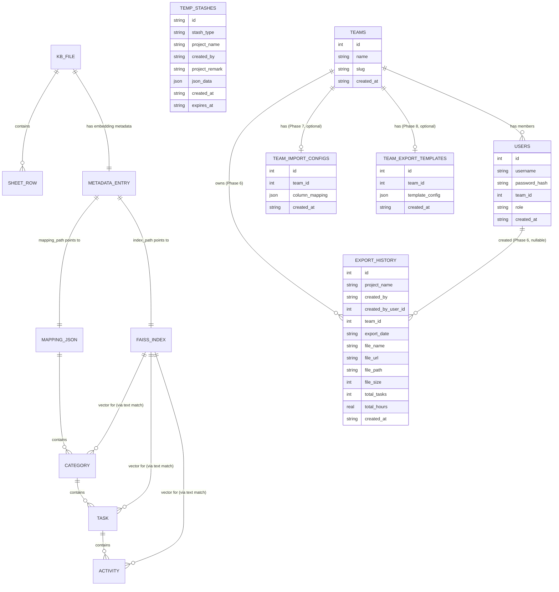

# MHES — Database

## Overview

MHES does **not use a relational database for its Knowledge Base or
embeddings data** — those are still filesystem-based, using `.xlsx`
files, JSON files, and FAISS binary index files as the "tables" (see §2–§6
below). As of Phase 4 (multi-team support), these files live under a
per-team folder tree, `storage/teams/<team_slug>/{knowledge,embeddings}/`,
instead of the old shared `kb_knowledge/`/`embeddings/` — see the Phase 4
note below and `docs/ARCHITECTURE.md` §5e.

However, MHES **does** use a real SQLite database, `database/mhes.db`,
as the backing store for four tables: **Preview Temporary Data stashes**
(§7), **Export History** (§8), **Teams** (§9, Phase 1 of multi-team
support), and, as of Phase 2, **Users** (§10). This is a plain `sqlite3`
connection (WAL mode) opened via `database/db.py` — there is no
ORM/SQLAlchemy model, just raw SQL executed from
`repositories/temp_repository.py`, `services/export_history_service.py`,
`repositories/team_repository.py`, and `repositories/user_repository.py`.
All four tables are created automatically (`CREATE TABLE IF NOT EXISTS`)
the first time the app starts.

**Multi-team support (Phase 1 — foundation only):** the `teams` table
and a seeded "Infrastructure Team" row exist so that Knowledge Base
files, Preview stashes, and export history can be attributed to a
specific team in a later phase. As of Phase 2, `temp_stashes` and
`export_history` still have no `team_id` column, and the Knowledge
Base/embeddings filesystem stores (§2–§6) are unchanged — that scoping
is still deferred to a later phase.

**Authentication (Phase 2 — login/session only):** the `users` table
adds real login credentials (hashed passwords via
`werkzeug.security`), a `routes/auth.py` blueprint (`/auth/login`,
`/auth/logout`), and Flask session-based login state. Each user belongs
to exactly one team (`users.team_id`) and has one of three roles
(`Admin`, `Team Manager`, `Member`). See §10 and
`docs/ARCHITECTURE.md` §5c.

**Role-based permissions (Phase 3 — no schema change):** `users.role`
(already added in Phase 2) is now actually enforced on every route via
`utils/permissions.py` — see `docs/ARCHITECTURE.md` §5d for the full
access matrix and a new `admin_bp` (`/admin/users`, `/admin/teams`,
Admin-only, read-only). This phase changed **no table or column** — it
only changed which requests are allowed to reach existing views.

**Team-based Knowledge Base (Phase 4 — no schema change either):**
`users.team_id` and `teams.slug` (both already added in Phase 1/2) are
now used to resolve a per-team filesystem folder for every Knowledge Base
read/write and every search — see `docs/ARCHITECTURE.md` §5e. Existing
Knowledge Base files and embeddings were migrated from the old shared
`kb_knowledge/`/`embeddings/` folders into the default team's isolated
tree by a new one-shot migration, `utils/migration.py::migrate_kb_to_team_storage`
— see §2–§5 below for the updated file locations, and the migration
process summary at the end of this document.

These two SQLite tables replace an older, filesystem-only design: Preview
stashes previously lived only in `temp_data/stashes.json`, and export
metadata was previously scattered across per-feature databases
(`temp_data/temp_storage.db`, `exports/export_history.db`). On startup,
`app.py` runs two idempotent one-shot migrations (`utils/migration.py`)
that import any legacy `stashes.json` records and merge rows from those
older per-feature databases into the single shared `mhes.db`; the old
files are left on disk untouched, but are no longer read by the running
application.

The sections below document both the file-based stores and the SQLite
tables — their schema (columns/fields), relationships, and purpose —
based on the actual read/write code in `services/excel_service.py`,
`services/excel_parser.py`, `services/embedding_service.py`,
`routes/export.py`, `database/db.py`, `repositories/temp_repository.py`,
`scheduler/temp_data_service.py`, and `services/export_history_service.py`.



`TEMP_STASHES`, `EXPORT_HISTORY`, `TEAMS`, `USERS`,
`TEAM_IMPORT_CONFIGS`, and `TEAM_EXPORT_TEMPLATES` (all stored in
`database/mhes.db`) are intentionally **not** connected to the
KB/embeddings chain above — none has a foreign-key relationship to any
KB file; each is an independent SQLite table keyed only by its own primary
key. `TEMP_STASHES` still has no `team_id`/`user_id` column at all — see
the Overview above and §7. `EXPORT_HISTORY`, `TEAM_IMPORT_CONFIGS`, and
`TEAM_EXPORT_TEMPLATES` all gained real foreign-key-style references to
`teams.id` (and, for `EXPORT_HISTORY`, `users.id`) — see §8, §9, §10,
§11, §12. `USERS.team_id` → `teams.id` remains the oldest such
relationship (every user belongs to exactly one team).

### Migration history (schema-level)

Two distinct mechanisms exist for evolving this schema, and both are
used across the multi-team phases:

| Mechanism | Tracked how | Used by |
|---|---|---|
| One-shot startup migrations | `db_migrations` table (`database/db.py`), checked/marked by `utils/migration.py` on every `app.py` startup | `stashes_json_to_sqlite_v1`, `merge_legacy_dbs_into_mhes_v1`, `create_default_team_v1`, `migrate_kb_to_team_storage_v1`, `create_default_admin_user_v1`, `seed_development_team_import_config_v1`, `seed_development_team_export_template_v1`, and each specially-supported team's own import/export config seed (`seed_bamawl_import_export_config_v3`, plus KiKan/SGL/SSD's equivalents in `utils/migrations/{team}_import_export_config.py`) |
| Lazy ALTER-if-missing | Checked via `PRAGMA table_info(...)` inside the owning service's own `__init__`, not `db_migrations` | `export_history.file_path` (pre-existing), `export_history.team_id`/`created_by_user_id` (Phase 6) — both in `ExportHistoryService._ensure_*_column(s)` |

| Table | Introduced | Columns added later | Backfill for pre-existing rows |
|---|---|---|---|
| `temp_stashes` | pre-multi-team | — | n/a (still no team/user column) |
| `export_history` | pre-multi-team | `file_path` (pre-multi-team); `team_id`, `created_by_user_id` (Phase 6) | Rows with `team_id IS NULL` backfilled onto the default team, every time `ExportHistoryService` is constructed |
| `teams` | Phase 1 | — | n/a (new table; seeded with "Infrastructure Team") |
| `users` | Phase 2 | — | n/a (new table; seeded with `admin`) |
| `team_import_configs` | Phase 7 | — | n/a (new table; optionally seeded for Development Team) |
| `team_export_templates` | Phase 8 | — | n/a (new table; optionally seeded for Development Team) |

Filesystem-level migrations (not SQLite, but run from the same
`utils/migration.py` startup sequence) are covered in
`docs/ARCHITECTURE.md`'s Migration History table — most notably Phase
4's `migrate_kb_to_team_storage`, which copies `kb_knowledge/`/`embeddings/`
into the default team's folder and retires the originals to `.bak`.

## 1. "Tables" (Filesystem Stores and SQLite Tables)

| Store | Location | Format | Written by | Read by |
|---|---|---|---|---|
| Knowledge Base File | `storage/teams/<team_slug>/knowledge/<filename>.xlsx` (Phase 4 — was the shared `kb_knowledge/<filename>.xlsx`) | Excel workbook | `ExcelService.save_file` (manual upload only — export never writes here, see §6's note) | `ExcelService.read_excel`, `excel_parser.excel_to_nested_json` |
| Embeddings Metadata | `storage/teams/<team_slug>/embeddings/metadata.json` (Phase 4 — was the shared `embeddings/metadata.json`) | JSON (dict keyed by filename, scoped to one team) | `EmbeddingService._save_metadata` | `EmbeddingService.get_file_metadata`, `has_index`, `SearchService` |
| FAISS Vector Index | `storage/teams/<team_slug>/embeddings/<index_name>.faiss` | FAISS binary index | `EmbeddingService.save_index` | `EmbeddingService.load_index`, `SearchService.semantic_search` |
| Mapping JSON | `storage/teams/<team_slug>/embeddings/<index_name>_mapping.json` | JSON (nested list) | `EmbeddingService.process_excel_file` | `SearchService` (all match/grouping functions) |
| Export Workbook | `exports/<project>_manhour.xlsx` | Excel workbook | `routes/export.py::_build_workbook` | downloaded by user (write-once, not re-read) |
| Temp Data Store | SQLite table `temp_stashes` in `database/mhes.db` | SQLite table | `TempRepository.insert` / `delete` / `delete_older_than` (via `TempDataService`) | `TempDataService.list_stashes` / `list_stashes_page` / `get_by_key`, `routes/preview.py`, `scheduler/temp_data_cleanup.py` |
| Export History | SQLite table `export_history` in `database/mhes.db` | SQLite table | `ExportHistoryService.insert_history` (from `routes/export.py`) | `ExportHistoryService.get_history` / `get_history_page` / `get_history_by_file_name`, `routes/export.py` |
| Teams | SQLite table `teams` in `database/mhes.db` | SQLite table | `utils/migration.py::create_default_team` (one-shot, at startup) | `repositories/team_repository.py::TeamRepository` (also read by `create_default_admin_user`, to attach the seeded admin to a team) |
| Users | SQLite table `users` in `database/mhes.db` | SQLite table | `utils/migration.py::create_default_admin_user` (one-shot, at startup); `repositories/user_repository.py::UserRepository.insert` (reserved for future admin-managed user creation — no UI yet) | `services/auth_service.py::AuthService.authenticate` (login), `utils/auth.py::get_current_user` (per-request session lookup) |

`index_name` = the KB filename without its `.xlsx` extension
(`os.path.splitext(filename)[0]`), so each KB file maps 1:1 to one
`.faiss` file and one `_mapping.json` file.

> **Note:** `temp_data/stashes.json` and the legacy per-feature databases
> (`temp_data/temp_storage.db`, `exports/export_history.db`) may still be
> present on disk from before the SQLite migration, but are no longer read
> by the running application except once, at startup, by the one-shot
> migration in `utils/migration.py` (see Overview above and §7/§8 below).

---

## 2. Table: Knowledge Base File (source Excel, `storage/teams/<team_slug>/knowledge/*.xlsx`)

**Purpose:** Man-hour breakdown data that gets embedded and searched. It
is never modified by the app once written (`embedding_service.py`
docstring: "The original Excel file is never modified"), regardless of how
it got there. As of Phase 4, each team has its own folder (see
`docs/ARCHITECTURE.md` §5e) — this was the shared `kb_knowledge/` before
that phase.

**Written by:** `ExcelService.save_file` (via `routes/upload.py`), into
the *uploading user's own team's* folder (`session["team_id"]` resolved
to a folder via `utils/team_storage.py`) — the sole source of truth for
this data. Export (`routes/export.py`) never writes here; it only
produces a separate, standalone downloadable workbook (§6).

**Columns** (matched flexibly by `excel_parser._map_columns` via
substring matching on header names, case-insensitive):

| Logical Column | Header keywords matched | Type | Notes |
|---|---|---|---|
| `category` | contains "category" or "project" | string | Forward-filled to handle merged cells |
| `task` | contains "task" (and not "detail") | string | Forward-filled to handle merged cells |
| `detail` | contains "detail" or "activity" | string | Required; rows without it are skipped |
| `estimate` | contains "estimate", or contains "hour" and not "buffer" | float | Coerced via `_safe_float` (NaN → 0.0) |
| `buffer` | contains "buffer" | float | Optional; if present, taken as the task-level buffer |

A workbook may contain multiple sheets; **all sheets are read** and merged
into one combined result (`pd.read_excel(..., sheet_name=None)`).

**Note:** Category names are **not unique across files** — the same
category name (e.g. a project reused as a template) can legitimately exist
in more than one KB file/mapping JSON. Nothing enforces uniqueness; this
is expected, and `SearchService` already scopes semantic-search results to
a single source file to avoid mixing results across duplicates.

---

## 3. Table: Embeddings Metadata (`storage/teams/<team_slug>/embeddings/metadata.json`)

**Purpose:** Central registry of which KB files have been embedded for
one team, so the app never needs to scan the filesystem to know
embedding status. Acts as the closest thing to an index/catalog table —
and, as of Phase 4, as the actual mechanism of team isolation: since
`SearchService` only ever loads the current team's `metadata.json` (a
different file per team, not a shared one with a team column), a team
simply cannot see another team's entries. Was the shared
`embeddings/metadata.json` before Phase 4.

**Schema** — top-level dict keyed by `filename`; each value is a record:

| Column | Type | Description |
|---|---|---|
| `filename` | string | KB Excel filename (primary key, duplicated as a field) |
| `categories` | list[string] | Names of top-level categories found in the file |
| `num_categories` | int | Count of categories |
| `num_vectors` | int | Count of embedded text chunks (category + task + activity levels) |
| `dimension` | int | Embedding vector dimensionality (model-dependent) |
| `index_path` | string | Absolute path to the file's `.faiss` index |
| `mapping_path` | string | Absolute path to the file's `_mapping.json` |
| `embedded_at` | string (ISO datetime) | Timestamp of last embedding generation |

**Relationships:** One record per KB file, within one team (1:1 with
`storage/teams/<team_slug>/knowledge/*.xlsx` by filename). `index_path`
and `mapping_path` are foreign-key-like pointers to the FAISS index and
mapping JSON described below.

---

## 4. Table: FAISS Vector Index (`storage/teams/<team_slug>/embeddings/<name>.faiss`)

**Purpose:** Enables nearest-neighbor semantic search. Stores one
embedding vector per text chunk (built with `IndexFlatL2`, i.e. exact L2
distance search, no approximation).

**"Columns":** A FAISS `IndexFlatL2` has no named fields — it stores raw
float32 vectors indexed by **position (0-based integer)**. There is no
explicit ID column; the vector's position in the index corresponds to the
same position in the ordered list produced by
`excel_parser.extract_texts_from_nested()` at embedding time.

**Relationships:** Resolved back to structured data at query time in
`SearchService.semantic_search`:
1. `extract_texts_from_nested(mapping_json)` reproduces the same ordered
   text list used at index-build time.
2. `_build_text_to_id(mapping_json)` maps each `text` string to its entry
   `id`.
3. `_build_id_lookup(mapping_json, filename)` maps each `id` to its full
   structured record (category/task/activity).

So the join path is: **FAISS position → text (by position) → id (by text)
→ structured record (by id)**. There is no stored numeric key linking a
vector directly to a mapping entry; the link is reconstructed from the
text content on every search. After the exact-match/word-overlap phase,
semantic-search hits are also filtered down to a single `source` file (the
best-scoring hit's file) before being grouped, so results never mix rows
from two different KB files.

---

## 5. Table: Mapping JSON (`storage/teams/<team_slug>/embeddings/<name>_mapping.json`)

**Purpose:** The structured, hierarchical representation of a KB file
(Category → Task → Activity), used both to resolve search hits and to
render/aggregate results. This is the "real" relational data — expressed
as nested JSON instead of normalized SQL tables.

### 5.1 Category (top-level array elements)

| Column | Type | Description |
|---|---|---|
| `id` | string | Slug-based ID, e.g. `<category-slug>_summary` |
| `type` | string | Always `"category_summary"` |
| `category` | string | Category display name |
| `task_count` | int | Number of tasks in this category |
| `total_estimate_hours` | float | Sum of all task estimate hours |
| `total_buffer_hours` | float | Sum of all task buffer hours |
| `grand_total_hours` | float | `total_estimate_hours + total_buffer_hours` |
| `tasks` | list[Task] | Child records (see below) |
| `text` | string | Generated natural-language summary used as an embedding chunk |

### 5.2 Task (`category.tasks[]`)

| Column | Type | Description |
|---|---|---|
| `id` | string | Slug-based ID, e.g. `<cat-slug>_<task-slug>_summary` |
| `task` | string | Task display name |
| `estimate_hours` | float | Sum of activity estimate hours |
| `buffer_hours` | float | Task-level buffer (from the Excel `buffer` column) |
| `total_hours` | float | `estimate_hours + buffer_hours` |
| `task_details` | list[Activity] | Child records (see below) |
| `text` | string | Generated natural-language summary used as an embedding chunk |

**Foreign key (implicit):** belongs to exactly one Category (parent by
array nesting, not a stored key).

### 5.3 Activity (`task.task_details[]`)

| Column | Type | Description |
|---|---|---|
| `id` | string | Slug-based ID, e.g. `<cat-slug>_<task-slug>_<detail-slug>` |
| `task_detail` | string | Activity display name (from the Excel `detail` column) |
| `estimate_hours` | float | From the Excel `estimate` column |
| `buffer_scope` | string | Always `"task-level"` |
| `buffer_note` | string | Explanatory text on how buffer applies (task-level vs standalone) |
| `standalone_buffer_hours` | float | Fixed constant `0.5` |
| `text` | string | Generated natural-language description used as an embedding chunk |

**Foreign key (implicit):** belongs to exactly one Task (parent by array
nesting).

**Relationships summary (Category 1—N Task 1—N Activity):**
- One Category has many Tasks.
- One Task has many Activities.
- IDs are derived by slugifying and concatenating parent names
  (`<category-slug>_<task-slug>_<detail-slug>`), so hierarchy is encoded
  in the ID string itself rather than a separate foreign-key field.

---

## 6. Table: Export Workbook (`exports/<project>_manhour.xlsx`)

**Purpose:** Output-only artifact generated on demand by
`routes/export.py::_build_workbook` from the same Category → Task
structure (columns: `Category`, `Task List`, `Estimate (Hours)`,
`Working Day`). Not read back by the application — it exists purely as a
downloadable deliverable for the user.

**This workbook is not part of the query/search data model at all** —
`routes/export.py` never writes into the Knowledge Base or triggers
embedding; the only way data enters the Knowledge Base is a manual
upload (§2).

---

## 7. Table: Temp Data Store (SQLite table `temp_stashes`, in `database/mhes.db`)

**Purpose:** Server-side backup of in-progress Preview data (Category →
Task → Activity being assembled, before export), so it survives closing
the browser — the active copy otherwise lives only in the browser's
`sessionStorage`. Managed entirely by `repositories/temp_repository.py`
(`TempRepository`, raw SQL only) via `scheduler/temp_data_service.py`
(`TempDataService`, business logic), and exposed via `routes/preview.py`
(`GET`/`POST /preview/temp/stashes`, `DELETE /preview/temp/stashes/<id>`).
Shared by everyone using the app — there is no per-user scoping, since
MHES has no authentication system.

**Schema** — one row per stash, table `temp_stashes`:

| Column | Type | Description |
|---|---|---|
| `id` | TEXT (primary key) | `uuid.uuid4().hex` |
| `stash_type` | TEXT | Always `"preview"` for Preview stashes (reserved for future stash types) |
| `project_name` | TEXT | Project name from Preview at the time of stashing (may be empty) |
| `created_by` | TEXT | "Created By" value from Preview at the time of stashing (may be empty) |
| `project_remark` | TEXT | Project-level rich-text Remark HTML from Preview at stash time (may be empty). Populated for **Infrastructure Team** only — the sole team whose Preview shows the project Remark editor (`scheduler/temp_data_service.py` writes it here, and also mirrors it inside `json_data` as `projectRemark`, so a restore recovers it either way). Empty for every other team |
| `json_data` | TEXT (JSON) | `{"categories": [...], "totals": {...}}` — same Category → Task → Activity shape used on the Preview screen (not the Mapping JSON shape in §5 — no `id`/`text` fields, just `category`, `source`, `tasks[].task/estimate_hours/buffer_hours/total_hours/activities[].task_detail/estimate_hours`) |
| `created_at` | TEXT (ISO datetime, naive/local) | `datetime.now().isoformat()` at stash time; also the basis for expiry |
| `expires_at` | TEXT (ISO datetime), nullable | Currently always `NULL` for Preview stashes; expiry is instead computed from `created_at` + retention days (see Lifecycle below) |

Indexed on `expires_at` and `stash_type` (`idx_temp_stashes_expires_at`,
`idx_temp_stashes_stash_type`) for the scheduled cleanup query and
type-filtered listing.

**Relationships:** None to the KB/embeddings tables above — a stash is a
self-contained snapshot, not a reference to any KB file (even though its
`json_data.categories[].source` field may happen to name one).

**Lifecycle:**
- **Created** by `TempDataService.add_stash`, triggered from the frontend
  when: (a) navigating to the Chatbot other than via "Add More / Back to
  Chatbot", or (b) the Preview tab is closed/refreshed/navigated away from
  outside the app while it has data (via `pagehide` + `sendBeacon`).
- **Removed individually** by `TempDataService.remove_stash`, on
  **Restore to Preview** (merges the stash back into the active
  `previewData` client-side, then deletes it) or **Discard**, both from
  `templates/temp_data.html`.
- **Removed by age** by `TempDataService.remove_older_than(days)`, called
  by `scheduler/temp_data_cleanup.py::delete_expired_temp_data`, which runs
  on an APScheduler cron schedule (`scheduler/scheduler.py`, default times
  configured by `Config.TEMP_DATA_CLEANUP_TIMES`, `Asia/Yangon` timezone)
  and is also invokable manually via `scheduler/cleanup_temp_data.py`.
  Retention is configured by `Config.TEMP_DATA_RETENTION_DAYS` (default 7
  days), compared against `created_at`.

**Migration note:** This table supersedes the older `temp_data/stashes.json`
flat-file store (and an even-older per-feature `temp_data/temp_storage.db`).
On startup, `utils/migration.py::migrate_stashes_json_to_sqlite` and
`merge_legacy_databases_into_mhes` import any existing legacy records into
`temp_stashes` exactly once (tracked via a `db_migrations` table in
`database/db.py`, so re-running on every startup is a safe no-op). The
legacy files are left on disk but are no longer read by the running app.

---

## 8. Table: Export History (SQLite table `export_history`, in `database/mhes.db`)

**Purpose:** Metadata registry of every generated Excel export, so the
Export History / Exported Files page can be rendered from a fast indexed
lookup instead of re-scanning and re-reading every Excel file on every
page load. Managed entirely by `services/export_history_service.py`
(`ExportHistoryService`, raw SQL only) and written to from
`routes/export.py` immediately after a new export is generated. The
actual Excel files themselves are untouched by this service — it only
records where a file is and what it contains.

**Schema** — one row per export, table `export_history`:

| Column | Type | Description |
|---|---|---|
| `id` | INTEGER (primary key, autoincrement) | Row id |
| `project_name` | TEXT | Project name entered on Preview at export time |
| `created_by` | TEXT | "Created By" value entered on Preview at export time (free text; may not match any real account) |
| `created_by_user_id` | INTEGER, nullable | **Phase 6.** Id of the actual authenticated user who triggered the export (`session["user_id"]`), distinct from the free-text `created_by` above. NULL for legacy/migrated rows predating authentication |
| `team_id` | INTEGER, nullable in schema but always populated in practice | **Phase 6.** Id of the team this export belongs to (`session["team_id"]` at export time). Every pre-Phase-6 row is backfilled onto the default team (see Migration note below); every new row always has one |
| `export_date` | TEXT | When the export was generated (ISO datetime string) |
| `file_name` | TEXT (not null) | Name of the generated Excel file as saved/uploaded |
| `file_url` | TEXT | URL used to download the file |
| `file_path` | TEXT, nullable | Where the file actually lives: a GCS object path (`mhes/bcmm/1002/...`) for exports created after the Google Cloud Storage migration, or a local absolute path for older records (see `docs/ARCHITECTURE.md` §5a) |
| `file_size` | INTEGER | Size of the generated file, in bytes |
| `total_tasks` | INTEGER | Total number of tasks across all categories in the export |
| `total_hours` | REAL | Total estimated hours across all tasks in the export |
| `created_at` | TEXT (ISO datetime) | Record creation timestamp; used for sorting/pagination |

Indexed on `created_at`, `file_name`, and (Phase 6) `team_id`
(`idx_export_history_created_at`, `idx_export_history_file_name`,
`idx_export_history_team_id`) for the Exported Files list's sort order,
the download/view routes' filename lookup, and per-team filtering.

**Relationships:** None to the KB/embeddings tables. `team_id` is a
foreign-key-style reference to `teams.id`, and `created_by_user_id` to
`users.id` (neither enforced by SQLite — see §13).

**Team-based access (Phase 6 — see `docs/ARCHITECTURE.md` §5f):**
`routes/export.py` resolves a `team_id` filter per request — `None` for
Admin (sees every team's exports), otherwise `session["team_id"]` — and
passes it into every read method below. A non-Admin request for another
team's export file (by filename, in `download_export`/`view_export`)
finds no matching row and is treated identically to "file not found";
there is no fallback that could leak a cross-team file.

**Lifecycle:**
- **Created** by `ExportHistoryService.insert_history`, called from
  `routes/export.py::export_excel` right after a workbook is built and
  uploaded to Google Cloud Storage (or, for pre-migration records,
  written locally). `team_id` is now a required argument.
- **Updated** by `ExportHistoryService.update_file_path`, used only by
  `utils/migrate_exports_to_gcs.py` to repoint a pre-migration record at
  its new GCS object path once the underlying file has been uploaded.
- **Read** by the Exported Files list (`get_history_page`, with
  date-range/project-name filtering, `team_id` filtering, and pagination
  applied in SQL) and by the download/view routes
  (`get_history_by_file_name`, also `team_id`-filtered) to resolve a
  filename from the URL back to its stored `file_path`.
- **Deleted** by `ExportHistoryService.delete_history` (removes only the
  metadata row; never touches the underlying Excel file).

**Migration note:** This table supersedes an older, separate
`exports/export_history.db` file. `utils/migration.py::merge_legacy_databases_into_mhes`
imports any rows from that legacy database into `export_history` exactly
once at startup, the same way it does for Temp Data (see §7) — as of
Phase 6, those imported rows are attributed to the default team, and
`create_default_team` now runs *before* this merge in `app.py` to
guarantee that team exists first. Separately,
`ExportHistoryService._ensure_team_columns` (Phase 6, mirroring the
existing `_ensure_file_path_column` pattern) ALTERs `team_id`/
`created_by_user_id` onto any `export_history` table created before
Phase 6, then backfills every row still missing a `team_id` onto the
default team — safe to run on every service construction, since the
ALTERs are no-ops once applied and the backfill only touches rows still
missing a `team_id`.

---

## 9. Table: Teams (SQLite table `teams`, in `database/mhes.db`)

**Purpose:** Foundation table for multi-team support (Phase 1 only — see
`docs/ARCHITECTURE.md` §5b). Represents a team/tenant. As of this phase
it is not yet referenced by any other table or scoping logic; it exists
so that Knowledge Base files, Preview stashes, and export history can be
attributed to a team in a later phase without requiring a breaking schema
change then. Managed entirely by `repositories/team_repository.py`
(`TeamRepository`, raw SQL only, mirroring the style of
`repositories/temp_repository.py`).

**Schema** — one row per team, table `teams`:

| Column | Type | Description |
|---|---|---|
| `id` | INTEGER (primary key, autoincrement) | Row id |
| `name` | TEXT (not null) | Display name, e.g. `"Infrastructure Team"` |
| `slug` | TEXT (not null, unique) | URL/path-safe identifier, e.g. `"infrastructure-team"` — intended for future use in per-team folder/prefix naming (KB folders, GCS export paths) |
| `created_at` | TEXT (ISO datetime) | Row creation timestamp |

Indexed on `slug` (`idx_teams_slug`) for fast lookup by slug.

**Relationships:** None yet. No other table has a `team_id` foreign key
as of this phase.

**Lifecycle:**
- **Created** by `utils/migration.py::create_default_team`, a one-shot
  startup migration (tracked in `db_migrations` as
  `create_default_team_v1`, same idempotent pattern as the other two
  migrations in that module — see §7/§8's migration notes). It creates
  the `teams` table if missing and seeds exactly one row: `name =
  "Infrastructure Team"`, `slug = "infrastructure-team"`. Safe to run on
  every startup — it no-ops (does not insert a duplicate) if a team with
  that slug already exists, and no-ops entirely once the migration has
  been marked applied.
- **Read** via `TeamRepository.get_by_id` / `get_by_slug` / `list_all` —
  not yet called from any route or service; reserved for a later phase
  (login, per-team scoping of KB/search/export).
- **No update/delete operations exist yet** — teams are not yet editable
  or removable through the app.

---

## 10. Table: Users (SQLite table `users`, in `database/mhes.db`)

**Purpose:** Login credentials and team/role assignment (Phase 2 of
multi-team support — see `docs/ARCHITECTURE.md` §5c). Enables real
authentication in place of the previous no-login model. Managed entirely
by `repositories/user_repository.py` (`UserRepository`, raw SQL only,
mirroring `repositories/team_repository.py`); credential verification
lives one layer up, in `services/auth_service.py` (`AuthService`).

**Schema** — one row per user, table `users`:

| Column | Type | Description |
|---|---|---|
| `id` | INTEGER (primary key, autoincrement) | Row id |
| `username` | TEXT (not null, unique) | Login name |
| `password_hash` | TEXT (not null) | Hashed via `werkzeug.security.generate_password_hash` — plaintext passwords are never stored or logged after initial seeding (see Lifecycle below) |
| `team_id` | INTEGER (not null) | References `teams.id` — the team this user belongs to (not DB-enforced; see §13) |
| `role` | TEXT (not null) | One of `"Admin"`, `"Team Manager"`, `"Member"` — enforced by a `CHECK` constraint at the SQLite level |
| `created_at` | TEXT (ISO datetime) | Row creation timestamp |

Indexed on `team_id` and `username` (`idx_users_team_id`,
`idx_users_username`).

**Relationships:** `team_id` is a foreign-key-style reference to
`teams.id` (not enforced by SQLite `PRAGMA foreign_keys`, consistent
with every other table in this database — see §13). `id` is referenced
by `export_history.created_by_user_id` as of Phase 6 (§8). No
relationship to `temp_stashes`, which still has no `user_id` or
`team_id` column, so a login does not yet scope or attribute anything a
user does elsewhere in the app.

**Lifecycle:**
- **Created (seed)** by `utils/migration.py::create_default_admin_user`,
  a one-shot startup migration (tracked in `db_migrations` as
  `create_default_admin_user_v1`) that runs after `create_default_team`.
  It seeds exactly one row: `username = "admin"`, `role = "Admin"`,
  `team_id` = the default "Infrastructure Team"'s id. The password is
  read from the `MHES_DEFAULT_ADMIN_PASSWORD` environment variable if
  set; otherwise a random one is generated with `secrets.token_urlsafe`
  and logged once, at `WARNING` level, to the application log
  (`logs/mhes.log`) — it is not recoverable afterwards, only re-hashed
  credentials are stored.
- **Created (going forward)** — no admin UI exists yet for creating
  additional users; `UserRepository.insert` is available for a future
  phase (or a one-off script) to call directly.
- **Read** by `services/auth_service.py::AuthService.authenticate`
  (`routes/auth.py`'s `POST /auth/login`) and by
  `utils/auth.py::get_current_user` (re-read from this table on every
  request, keyed by the `user_id` stored in the Flask session — the
  session itself never holds a password or password_hash).
- **No update/delete operations exist yet** — users are not yet
  editable, deletable, or able to change their own password through the
  app.

**Login/session mechanics:** `POST /auth/login` verifies
username+password via `AuthService.authenticate`, then stores
`user_id`, `username`, `team_id`, `role` in Flask's built-in,
`SECRET_KEY`-signed session cookie (the same session mechanism already
used for flash messages elsewhere in the app — no new cookie/session
library was introduced). `POST /auth/logout` clears the session
entirely. As of Phase 3 (`docs/ARCHITECTURE.md` §5d), `session["role"]`
is read on every request by `utils/permissions.py` to enforce the access
matrix — Upload/KB management requires `Admin` or `Team Manager`;
Chatbot/Preview/Export require any logged-in role; `/admin/*` requires
`Admin`.

---

## 11. Table: Team Import Configs (SQLite table `team_import_configs`, in `database/mhes.db`)

**Purpose:** Per-team Excel column-role mapping (Phase 7 of multi-team
support — see `docs/ARCHITECTURE.md` §5g), so different teams can label
the same underlying data with completely different headers (e.g.
Development/Bamawl Team's `Feature`/`Technology`/`Hours`) without a
separate parser per team. Managed entirely by
`repositories/team_import_config_repository.py`
(`TeamImportConfigRepository`, raw SQL only, mirroring
`repositories/team_repository.py`).

**Schema** — at most one row per team, table `team_import_configs`:

| Column | Type | Description |
|---|---|---|
| `id` | INTEGER (primary key, autoincrement) | Row id |
| `team_id` | INTEGER (not null, unique) | The team this mapping belongs to — at most one config per team |
| `column_mapping` | TEXT (JSON, not null) | One of two shapes — see below. Roles/keys the config omits fall back to generic keyword detection where applicable (see `docs/ARCHITECTURE.md` §5g) |
| `created_at` | TEXT (ISO datetime) | Row creation timestamp |

`column_mapping` holds one of two JSON shapes (the same column, just a
richer schema added later — no migration needed, since it was always an
opaque JSON blob to this table):

1. **Flat mode** (Phase 7) — one Activity per row:
   ```json
   {"category": "Technology", "task": "Feature", "detail": "Feature", "estimate": "Hours"}
   ```
   Dict of MHES role -> that team's actual Excel header name.

2. **Phases mode** (added later — see `docs/ARCHITECTURE.md` §5i) —
   *many* Activities per row, one per phase column, so a row's full
   phase-by-phase hour breakdown (Development, Code Review, QA, ...) is
   preserved instead of collapsed into a single total:
   ```json
   {
     "sheet": "ALL_Detail",
     "header_row": 4,
     "task_column": "Function",
     "id_column": "ID",
     "category_column": "Requirements",
     "phase_columns": [
       {"label": "Development", "column": "Development man-hours (h)"},
       {"label": "Code Review", "column": "Code review (h)"}
     ],
     "total_column": "Total(h)",
     "extra_columns": [{"field": "status", "column": "Status"}]
   }
   ```
   `sheet`/`header_row` also fix a real-world problem flat-mode files
   didn't have: some teams' actual workbooks have their header row
   several rows down (a percentage/phase-group block sits above it),
   which `excel_parser`'s default row-1-header assumption can't handle
   without this override. `category_column` reads a real per-row
   grouping column (forward-filled) as each task's Category — Bamawl's
   `ALL_Detail` uses its **Requirements** column this way, so each
   Requirement becomes a Category above its tasks (replacing the older
   fixed `"category"` literal). `extra_columns` captures any other
   same-row column verbatim onto the task (Bamawl/KiKan use it for
   `Status`).

Indexed on `team_id` (`idx_team_import_configs_team_id`).

**Relationships:** `team_id` is a foreign-key-style reference to
`teams.id` (not enforced by SQLite, consistent with every other
reference in this schema — see §13). No relationship to
`kb_knowledge`/embeddings files — this table only holds *how to parse*
a team's Excel files, never their content.

**Lifecycle:**
- **Created/updated** by `TeamImportConfigRepository.upsert()` — one row
  per team, replaced wholesale on each call (no partial-update method).
  As of Phase 7 there is no UI for this; it's called directly (a one-off
  script, or the demo seed below) — a future phase may add an
  admin/Team-Manager page to edit it.
- **Seeded (demo only)** by
  `utils/migration.py::seed_development_team_import_config` — a
  best-effort, environment-specific seed (not a guaranteed migration:
  "Development Team" isn't one of MHES's default teams) that configures
  Development Team's mapping if that team happens to exist.
- **Read** by `routes/upload.py::_team_column_mapping()` (looked up by
  `session["team_id"]`) before every call to
  `EmbeddingService.process_excel_file`, which passes it straight
  through to `excel_parser.excel_to_nested_json`. That function inspects
  the config to decide which mode applies: a `phase_columns` key routes
  it to `_process_phases_sheet` (phases mode); otherwise it goes through
  `_map_columns` (flat mode). A team with no row here (`get_by_team_id`
  returns `None`) parses using only the original generic keyword
  matching — byte-identical to every KB file parsed before Phase 7.
- **No delete operation exists yet.**
- **Seeded for phases mode**: in addition to the flat demo mapping
  (`seed_development_team_import_config`), Bamawl/KiKan/SGL/SSD each now
  have their own tracked one-shot seed migration
  (`utils/migrations/{bamawl,kikan,sgl,ssd}_import_export_config.py`)
  that upserts their real phases-mode config for their own official
  template. Bamawl's is `seed_bamawl_import_export_config_v3` — the `_v3`
  bump (from `_v2`) re-seeds even databases where an earlier version
  already ran, so its move to `category_column: "Requirements"` (from the
  old fixed `category` literal) and its `extra_columns` Status capture
  take effect. Each is looked up by team **name**, not slug.

---

## 12. Table: Team Export Templates (SQLite table `team_export_templates`, in `database/mhes.db`)

**Purpose:** Per-team Excel export column layout (Phase 8 of multi-team
support — see `docs/ARCHITECTURE.md` §5h), so different teams can have
their own export column set/labels/widths without a separate workbook
builder per team. Managed entirely by
`repositories/team_export_template_repository.py`
(`TeamExportTemplateRepository`, raw SQL only, mirroring
`repositories/team_import_config_repository.py`).

**Schema** — at most one row per team, table `team_export_templates`:

| Column | Type | Description |
|---|---|---|
| `id` | INTEGER (primary key, autoincrement) | Row id |
| `team_id` | INTEGER (not null, unique) | The team this template belongs to — at most one per team |
| `template_config` | TEXT (JSON, not null) | `{"sheet_title": "...", "columns": [{"key": ..., "label": ..., "width": ...}, ...]}`. Recognized `key` values: `category`, `task`, `estimate_hours`, `working_day`, `remarks` — see `docs/ARCHITECTURE.md` §5h. A team with no row here uses `routes.export.DEFAULT_EXPORT_TEMPLATE`, reproducing the exact pre-Phase-8 layout |
| `created_at` | TEXT (ISO datetime) | Row creation timestamp |

Indexed on `team_id` (`idx_team_export_templates_team_id`).

**Relationships:** `team_id` is a foreign-key-style reference to
`teams.id` (not enforced by SQLite, consistent with every other
reference in this schema — see §13). No relationship to `export_history`
— this table only holds *how to lay out* a team's export workbook, not
any record of past exports.

**Lifecycle:**
- **Created/updated** by `TeamExportTemplateRepository.upsert()` — one
  row per team, replaced wholesale on each call. No UI yet — configured
  directly (a one-off script, or the demo seed below); a future phase
  may add an edit page.
- **Seeded (demo only)** by
  `utils/migration.py::seed_development_team_export_template` — a
  best-effort, environment-specific seed (not a guaranteed migration)
  that configures Development Team's compact 4-column template if that
  team happens to exist.
- **Read** by `routes/export.py::_team_export_template()` (looked up by
  `session["team_id"]`) before every call to `_build_workbook`, which
  uses it to drive column widths, headers, and per-cell content — or
  falls back to `DEFAULT_EXPORT_TEMPLATE` if the team has no row here.
- **No delete operation exists yet.**

---

## 13. Referential Integrity Notes

- There are no database-level constraints (no foreign keys, no
  transactions). Consistency between a team's
  `storage/teams/<slug>/knowledge/*.xlsx`,
  `storage/teams/<slug>/embeddings/metadata.json`,
  `storage/teams/<slug>/embeddings/*.faiss`, and
  `storage/teams/<slug>/embeddings/*_mapping.json` is maintained purely by
  application logic:
  - `EmbeddingService.process_excel_file` writes all three embedding
    artifacts (index, mapping, metadata entry) together, called from
    `routes/upload.py` (the only way data enters the Knowledge Base).
  - `EmbeddingService.delete_index` removes the `.faiss` file, the
    `_mapping.json` file, and the `metadata.json` entry together.
  - `routes/upload.py::delete_file` calls `emb.delete_index()` before
    `svc.delete_file()`, keeping the Excel file and its embeddings in
    sync.
  - Which team's folder any of this happens in is resolved once, per
    request, from `session["team_id"]` (Phase 4, see
    `docs/ARCHITECTURE.md` §5e) — there is no cross-team consistency
    concern because a request's `ExcelService`/`EmbeddingService` never
    holds a reference to any other team's folder.
- If a KB `.xlsx` file is deleted without going through the app (e.g.
  manually from disk), its `metadata.json` entry and FAISS/mapping files
  would become orphaned — no code currently detects or cleans up this
  case.
- The Temp Data Store (`temp_stashes` table) and Export History
  (`export_history` table) are both fully independent of the KB/embeddings
  files — deleting a KB file has no effect on any existing stash or export
  history record, and vice versa. Both live in the same shared SQLite
  database, `database/mhes.db` (`database/db.py`), opened in WAL mode with
  a 30-second busy timeout, which lets Flask's request-handling threads,
  the APScheduler background thread, and standalone CLI scripts
  (`scheduler/cleanup_temp_data.py`, `utils/migrate_exports_to_gcs.py`)
  safely share the same file concurrently — unlike the old flat-JSON
  design, writes are now transactional per-statement rather than
  read-modify-write of an entire file.
- There are still no foreign-key constraints between `temp_stashes` and
  `export_history`, or between either of them and the KB/embeddings files;
  each table's consistency is self-contained. `temp_stashes` in
  particular still has no `team_id`/`user_id` column at all (Phase 6
  scoped only `export_history`, per its task — Preview stash scoping
  remains a gap for a future phase).
- A `db_migrations` table (in `database/db.py`) tracks which one-shot
  migrations have already run (`stashes_json_to_sqlite_v1`,
  `merge_legacy_dbs_into_mhes_v1`, `create_default_team_v1`,
  `migrate_kb_to_team_storage_v1`, `create_default_admin_user_v1`), so
  the legacy-import, team-seeding, KB-storage-migration, and
  admin-user-seeding logic in `utils/migration.py` is safe to invoke on
  every application startup without re-importing or duplicating rows or
  files. `export_history`'s Phase 6 `team_id`/`created_by_user_id`
  columns are **not** tracked here — they follow the older, separate
  `_ensure_file_path_column`-style pattern instead (an ALTER-if-missing
  check run from `ExportHistoryService.__init__` itself, not a
  `db_migrations`-tracked startup step), since that was the existing
  convention for this exact table.
- `users.team_id` was the first column in this database to reference
  another table's primary key (`teams.id`); `export_history.team_id` and
  `export_history.created_by_user_id` (Phase 6) are the next two. Like
  every reference in this schema, none is enforced by a SQLite
  foreign-key constraint (`PRAGMA foreign_keys` is left at its default,
  off) — authorization (which team can see/download which export) is
  enforced entirely in `routes/export.py`/`services/export_history_service.py`
  application code, not the database.
